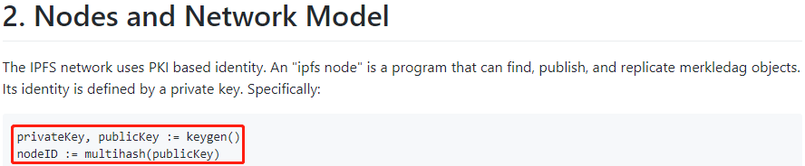

# IPFS peer id的生成和为什么以Qm为前缀

## IPFS peer的密钥和id是怎么生成的

在执行ipfs init命令后，log里面会显示“generating 2048-bit RSA keypair...done”，同时会显示peer identity，即peer的id，如下图：

ipfs的架构文档（ https://github.com/ipfs/specs/tree/master/architecture ）中提到：

"The IPFS network uses PKI based identity".如下图：

ipfs为一个peer产生了一个RSA密钥对，包含私钥和公钥。另外，Qm开头的id是对peer的公钥进行哈希运算之后产生的哈希值。也就是说，这里产生了三个东西：私钥、公钥、id（公钥的哈希）。

IPFS在配置文件~/.ipfs/config中存储密钥信息，如下图：

至于为什么只存储了私钥和id，没有存储公钥，目前还不清楚，待调查。但我个人理解，只要有了私钥，公钥就可以生成，公钥是根据私钥生成的，但是私钥不能通过公钥生成，这是单向加密。

当peer彼此连接时，它们彼此交换公钥。通信是使用这些密钥加密的。加密通信的具体细节以后有机会再单独研究，然后写wiki。一个peer可以检查另一个peer的id是否匹配它提供的公钥的哈希值，以确保peer正在与正确的peer通信。

那么具体使用的什么方法生成密钥对呢？经调查，是使用的Golang的crypto/rand module，使用系统提供的熵源（entropy sources）来生成随机的密钥对。

当一个peer和其他peer进行通信时，它用于通信的url是比如：/ip4/104.223.59.174/tcp/4001/ipfs/QmeWdgoZezpdHz1PX8Ly8AeDQahFkBNtHn6qKeNtWP1jB6 。这其中包含了几个信息：ip，端口，peer id。

假设网络中有一个正常工作的peer A。有一个恶意的peer B，企图把自己假扮成peer A，然后向网络上的其他peer（peer C）发信息。即使peer B知道peer A的id，在peer B不知道peer A的公钥的情况下，那么在peer B向peer C发消息的时候，只能提供peer A的id，但是不能提供和该id匹配的公钥，这样的话peer C就会认为peer B发的消息不对，至于具体如何处理，还没有研究。这里对于消息交互和加密的描述只是粗浅的描述，也许还不一定正确，只是个人理解，深入的细节还待更进一步的调查。

## 为什么id的前缀是Qm

刚刚提到了，id是哈希值。IPFS使用了一种称为Multihash的协议来产生哈希。这个协议的深入内容还没研究，想了解细节请参考https://github.com/multiformats/multihash

Multihash协议提供了多种哈希算法，而IPFS采用了其中的SHA2_256，这种算法会在生成的哈希前面加上十六进制的前缀0x12，请见https://github.com/multiformats/go-multihash/blob/master/multihash.go#L41 。另外，SHA2_256算法默认生成的哈希的长度是32，请见https://github.com/multiformats/go-multihash/blob/master/multihash.go#L139 ，32转换成十六进制就是0x20，这个长度也会被加到生成的哈希的前缀中。也就是说，前缀就是0x12和0x20，那就是0x1220

另外，peer id不仅涉及到哈希算法，还涉及一个编码的问题。IPFS使用的是base58编码。这样的话带有0x1220前缀的哈希值通过base58的编码，正好前缀是Qm。如下图：

我自己也专门在一个在线base58编码的网站（ https://incoherency.co.uk/base58/ ）测了一下，结果的确如此，如下图：

这样就搞清楚了为什么peer id是以Qm开头。并且不仅peer id以Qm开头，IPFS里面pin的内容的hash都是以Qm开头，就是这个道理。

总结一下，就是：Q对应哈希算法SHA2_256，m对应哈希值长度。
