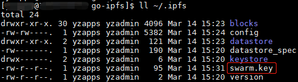
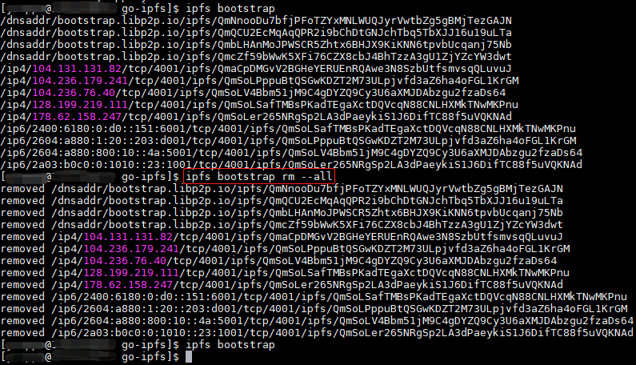
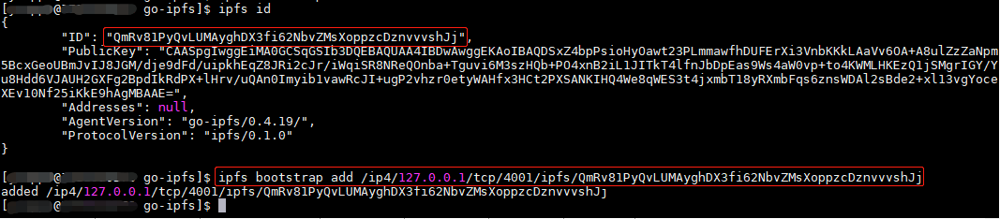
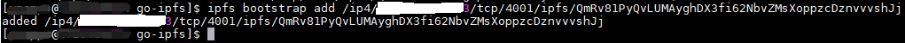
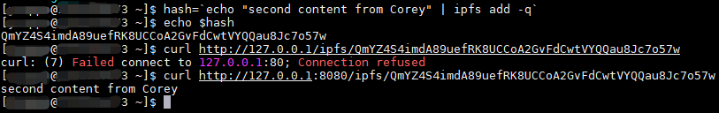
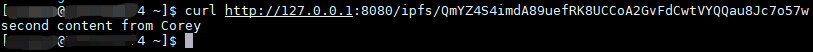
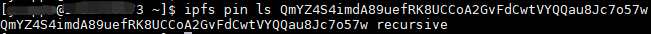
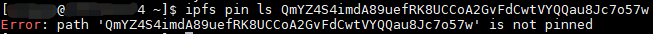

> 如想了解更多内容，请关注微信公众号“Corey区块链技术分享”。

# IPFS private network部署

IPFS private network允许ipfs只连接到拥有一个共享secret key（密钥）的其他peer，这样就能和公网隔离，建立自己的私有网络，更加适合联盟链。

下面就分享一下具体搭建private network的详细步骤：

## 1.安装和初始化ipfs

选择几台Linux服务器（我部署了3台），在每台服务器上安装并初始化ipfs，具体操作完全参考另一篇博客[IPFS安装和基本使用](install_ipfs_and_basic_usage.md)的第1步到第5步，没有任何差异。

## 2.安装Go

只需要选择其中一台服务器安装Go即可，Go的安装不在本文的范围，大家自行参考其他资料。

## 3.生成共享的swarm.key文件

* 下载工具ipfs-swarm-key-gen

      go get github.com/Kubuxu/go-ipfs-swarm-key-gen/ipfs-swarm-key-gen

* 把swarm.key生成到~/.ipfs目录中。

      ipfs-swarm-key-gen > ~/.ipfs/swarm.key

## 4.复制swarm.key到network private中的其他ipfs peer

在生成swarm.key的server上，通过scp命令把swarm.key复制到其他两台peer的~/.ipfs目录中。要加入一个特定的私有网络，必须将共享的swarm.key文件保存到~/.ipfs/路径(如果使用自定义的$IPFS_PATH，则将其放在其中)。

## 5.设置每个peer的引导节点

当使用private network特性时，ipfs peer将无法连接到默认的引导节点(因为默认的引导节点不是我们要搭建的私有网络的一部分)，所以需要设置自己的引导节点。

首先，要防止ipfs peer试图连接到默认的引导节点，请在每台server上运行:

    ipfs bootstrap rm --all

然后添加自己的引导节点（使用ipfs bootstrap add <multiaddr>命令）。注意，这个private network有三个ipfs peer，总有其中一个要最先启动运行，所以我们挑选一台最先启动运行的，把它的引导节点设置为它自己，操作请看下面的图片

然后在另外两个peer上把引导节点设置为最先启动运行的peer，这样的话节点启动的时候就能够连接到引导节点，操作请看下面的图片

## 6.设置LIBP2P_FORCE_PNET环境变量

需要特别注意的是，最好在每台server上都将LIBP2P_FORCE_PNET环境变量设置为1，以强制使用私有网络。如果没有配置私有网络，ipfs daemon将无法启动。

    export LIBP2P_FORCE_PNET=1

## 7.让节点上线

在每台server上，都运行

    ipfs daemon

注意：如果要用IPFS Cluster来管理IPFS private network，则运行ipfs daemon时不要带--enable-gc参数

注意：启动日志里会有一句话“Swarm is limited to the private network of peers with the swarm key”表明这是启动的私有网络

另外，如果想让ipfs daemon后台运行，可以执行以下命令

    nohup ipfs daemon > ipfs.log 2>&1 & disown

注意：命令结尾的disown必须要，不然的话关闭terminal之后后台进程就会收到Ctrl+C信号而退出

## 8.测试私有网络是否搭建成功

* 在server 1上用ipfs add命令添加内容

* 在server 2上通过本地ipfs网关查看server 1添加的内容

* 在server 1上查看这个内容是否被pin住

  可见在server 1上这个内容是被pin住的，因为是在server 1上被添加的

* 然后在server 2上查看这个内容是否被pin住

  可见在server 2上这个内容没有被pin住，在server 2上获取该内容之后，该内容被存储到server 2的缓存中，在垃圾收集时会被清除掉。那么问题就来了，在server 1上添加的内容只在server 1上被pin住，在其他server上都没有被pin住，那么如果server 1就成了一个单点瓶颈，如何解决这个问题呢？就需要用到IPFS Cluster，以后的博客会专门分享IPFS Cluster.

> 如想了解更多内容，请关注微信公众号“Corey区块链技术分享”。
