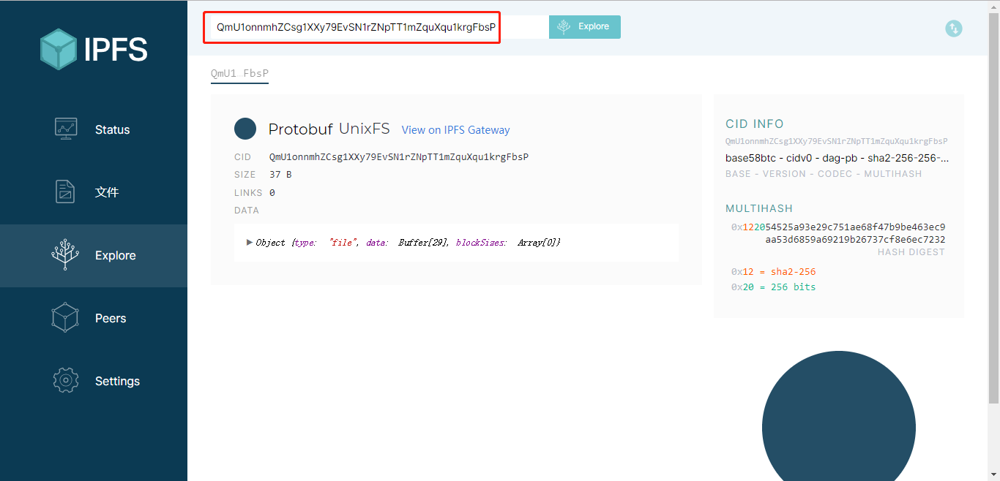

> 如想了解更多内容，请关注微信公众号“Corey区块链技术分享”。

# IPFS安装和基本使用

IPFS的概念和理论知识就不讲了，请自己读文档，这里直接进入实践。

注意：IPFS的官网被屏蔽了，必须fan~qiang才能进入，各位老司机自己想办法。

不管是在Linux还是windows上安装，IFPS官方都推荐使用预编译好的安装包进行安装。

## 1.下载Linux安装包

在浏览器打开https://dist.ipfs.io/#go-ipfs ，下载安装包，我下载的是go-ipfs_v0.4.19_linux-amd64.tar.gz

## 2.在Linux主机1上，解压安装包并执行安装

把下载的安装包放到Linux主机的某个目录，用以下命令解压：

    tar xvfz go-ipfs_v0.4.19_linux-amd64.tar.gz
    
然后进入解压后的go-ipfs目录：

    cd go-ipfs
    
再执行安装命令:

    ./install.sh
    
安装成功之后，运行ipfs help测试是否安装成功

## 3.初始化IPFS

IPFS将所有设置和内部数据都存储在一个称为repository的目录中，在首次使用IPFS之前，需要使用ipfs init命令初始化存储库。如果不设置环境变量$IPFS_PATH，那么Linux中，repository默认位于~/.ipfs。

peer identity之后的哈希是节点的ID，网络上的其他节点使用这个ID来查找和连接到当前节点。可以在任何时候运行ipfs id命令来再次获得ID。

## 4.ipfs cat

尝试运行ipfs init输出中建议运行的命令ipfs cat /ipfs/<HASH>/readme。

## 5.修改配置文件中的配置（可选）

这一步是可选的，由于默认IPFS节点存储的内容的size最多可以达到10G，但是我不想让我Linux主机存储这么多内容，所以需要修改一下配置。

打开配置文件~/.ipfs/config，把字段StorageMax的值从默认的10G改为1G。

## 6.让节点上线

运行ipfs daemon命令，让节点上线，此命令有很多可选的参数，我加上了参数--enable-gc，打开垃圾收集

注意，上图中红色框起来的部分必须出现，才说明上线成功

## 7.检查连接到的节点

打开一个新的命令行终端，执行ipfs swarm peers。如果成功连接到网络，应该能够看到当前节点连接到的公网上的其他节点的ipfs地址。

## 8.添加内容到IPFS网络

现在就能够使用ipfs add命令添加内容到IPFS网络了

## 9.通过公共ipfs网关ipfs.io获取刚刚添加的内容

由于ipfs在中国被墙了，无法通过公共网关访问内容，这个目前没办法解决。但这不影响我们使用本地网关访问ipfs上的内容，记住，ipfs是去中心化的，点对点的。

## 10.通过节点的本地网关获取刚刚添加的内容

获取成功

## 11.安装Linux主机2

在另外一台Linux主机，Linux主机2上也通过上述1到7步安装好ipfs节点，并让节点上线

## 12.在Linux主机2上查看Linux主机1添加的内容

之前在Linux主机1上向ipfs网络添加了内容，现在我们试着从Linux主机2上获取一下：

访问成功。这说明Linux主机1添加的内容已经通过P2P的方式成功传给了Linux主机2，可以理解为内容已经在公网上。

## 13.在windows主机上安装IPFS

在https://dist.ipfs.io/#go-ipfs下载windows的安装包go-ipfs_v0.4.19_windows-amd64.zip，然后解压，得到一个go-ipfs目录，进入这个目录，执行ipfs help命令验证是否安装成功。然后执行ipfs init和ipfs daemon命令让节点上线。

注：执行ipfs init之后，节点的repository目录是User的目录，比如我的目录是C:\Users\hp\.ipfs

## 14.在windows主机上获取Linux主机1添加的内容

说明在Linux主机1上添加的内容能够从Linux主机2以及windows主机被访问

## 15.在windows主机上访问webui

IPFS提供了一个webui，更方便管理，在浏览器中打开http://127.0.0.1:5001/webui

在页面上输入之前添加的内容的哈希，可以看到这个内容的更详细的信息

关于这个webui，大家可以多使用，多探索其用法。

> 如想了解更多内容，请关注微信公众号“Corey区块链技术分享”。
