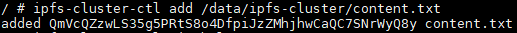
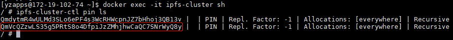
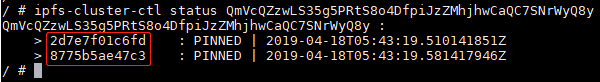

# 用docker部署IPFS cluster

本文讲解如何用docker部署IPFS cluster

IPFS cluster的部署有两种方式：1.Starting multiple peers with a fixed peerset 2.Starting a single peer and bootstrapping the rest to it

请分别参考官方文档https://cluster.ipfs.io/documentation/starting/#starting-multiple-peers-with-a-fixed-peerset , https://cluster.ipfs.io/documentation/starting/#starting-a-single-peer-and-bootstrapping-the-rest-to-it

第一种方式是使用固定的peer集启动多个peer，这种方式有一个前提条件：需要在启动多个peer之前在每个peer的service.json配置文件中配置init_peerset配置项，其值需要列出准备加入cluster的所有peer的peer ID。然而，service.json文件是在运行ipfs-cluster-service init之后自动生成的，生成之后再执行ipfs-cluster-service daemon。也就是说，逻辑上我们就需要在运行完ipfs-cluster-service init之后去手工配置service.json里的init_peerset，然后再运行ipfs-cluster-service daemon。

这样问题就来了，从ipfs-cluster的Dockerfile中可以看到，entrypoint.sh是容器启动时要执行的命令，在entrypoint.sh中，可以看到，ipfs-cluster-service init命令和ipfs-cluster-service daemon命令是连续自动执行的。也就是说，运行docker run之后，我们根本没有机会手工去修改service.json中的init_peerset配置项。所以第一种部署方式“Starting multiple peers with a fixed peerset”对于docker的部署方法来讲不合适。当然，也可以在执行docker run之前提前准备好整个service.json，这就要求对service.json很熟悉，这样增加了复杂度，容器出错。

Dockerfile的链接：https://github.com/ipfs/ipfs-cluster/blob/master/Dockerfile

entrypoint.sh的链接：https://github.com/ipfs/ipfs-cluster/blob/master/docker/entrypoint.sh

所以，如果用docker部署的话，就采用第二种部署方式“Starting a single peer and bootstrapping the rest to it”。这种方式更加的灵活。先启动一个peer，然后引导其他peer加入它。在引导新peer加入时，cluster的规模将随着新peer的加入一起增长。这对于不断有新的peer加入的cluster是很灵活的，且这种方式不需要像第一种方式那样提前准备peerstore文件和init_peerset配置项，更为简单。

## 前提条件：

ipfs已经安装并且运行在主机上

## 部署流程

### 1. 配置IPFS cluster peer与IPFS peer之间的通信

IPFS cluster peer是基于IPFS peer工作的，实际的pin/unpin内容最终也是通过IPFS peer来执行，所以两者之间必须要保证成功的通信。service.json文件中的ipfs_connector/ipfshttp/node_multiaddress配置项就用于配置IPFS daemon的HTTP API endpoint，前面说了，我们没有机会手工修改service.json文件，也就是不能直接修改文件。那这该怎么配置呢？在docker run的时候，设置$IPFS_API环境变量为IPFS daemon HTTP API endpoint，比如/ip4/127.0.0.1/tcp/5001。如果不设置此环境变量，就会使用默认的值：/ip4/127.0.0.1/tcp/5001。

注意：如果在ipfs peer的配置文件~/.ipfs/config中，把API地址配置为"API": "/ip4/0.0.0.0/tcp/5001"，那么$IPFS_API环境变量就不能设置为/ip4/127.0.0.1/tcp/5001，而必须把127.0.0.1 loopback地址设置成主机对外的ip，比如/ip4/172.19.102.73/tcp/5001。这个我验证过。至于为什么不能把$IPFS_API环境变量配置为/ip4/127.0.0.1/tcp/5001，这还需要继续探究，由于时间关系，暂且搁置。

**这一步并没有触发具体的命令，只是为后续运行docker run命令做准备。**

### 2. 挂载配置和内容volume

在ipfs cluster容器内，配置文件路径为：/data/ipfs-cluster，这是容器内的路径，需要用一个主机的文件夹作为volume挂载到此路径，以便为peer提供自定义配置和内容/数据持久化。这里就需要在主机上用mkdir创建一个路径，然后后续在docker run命令中用参数-v <your_local_path>:/data/ipfs-cluster进行挂载。

**这一步并没有触发具体的命令，只是为后续运行docker run命令做准备。**

### 3. 覆盖ENTRYPOINT的参数

从ipfs-cluster的Dockerfile中可以看到，docker run会默认执行ipfs-cluster-service daemon --upgrade，而不是ipfs-cluster-service daemon。所以如果不想执行--upgrade，可以运行docker run时跟上参数，覆盖CMD提供的默认参数：docker run ipfs/ipfs-cluster daemon。至于为什么会默认加上--upgrade升级参数，还没有进一步探究，以后再探究。

**这一步并没有触发具体的命令，只是为后续运行docker run命令做准备。**

### 4. publish端口

在Dockerfile中，EXPOSE了三个端口：9094,9095,9096. 我们在docker run的时候需要用-p 9094:9094 -p 9095:9095 -p 9096:9096来publish这三个端口。

**这一步并没有触发具体的命令，只是为后续运行docker run命令做准备。**

### 5. 配置CLUSTER_SECRET环境变量

IPFS一个cluster里的peer需要共享一个相同的secret，密钥。可以通过设置环境变量CLUSTER_SECRET来设置这个secret，再强调一次，所有peer的密钥必须相同。

生成密钥：你可以通过如下命令获得一个十六进制编码的随机字符串，即secret：

    export CLUSTER_SECRET=$(od -vN 32 -An -tx1 /dev/urandom | tr -d ' \n')

    echo $CLUSTER_SECRET

这样就得到了secret的值。在docker run命令中通过参数-e CLUSTER_SECRET=***传进去，比如-e CLUSTER_SECRET=87891a1f34d9898a9bdfad16297305740ce33b6b7602b89f9061b00caf092b71

**这一步并没有触发具体的命令，只是为后续运行docker run命令做准备。**

### 6. 自定义容器的名称

在docker run的时候用--name自定义容器的名称，比如--name ipfs-cluster

**这一步并没有触发具体的命令，只是为后续运行docker run命令做准备。**

### 7. 在第一个peer上执行docker run

第1到第5步都是为这一步做准备。基于前面的步骤，我们在第一个peer（比如172.19.102.73）上执行：

    docker run -d --name ipfs-cluster -v ~/.ipfs-cluster:/data/ipfs-cluster -e IPFS_API="/ip4/172.19.102.73/tcp/5001" -e CLUSTER_SECRET=87891a1f34d9898a9bdfad16297305740ce33b6b7602b89f9061b00caf092b71 -p 9094:9094 -p 9095:9095 -p 9096:9096 ipfs/ipfs-cluster daemon

这样cluster的第一个peer就启动成功了

### 8. 获取第一个peer的ID，以为引导其他peer加入cluster时使用

先进人docker容器的sh：

    docker exec -it ipfs-cluster sh

注意：Dockerfile有一句FROM busybox:1-glibc，busybox没有提供bash，只提供了sh

通过命令ipfs-cluster-ctl id获取第一个peer的ID

另外，也可以不进入容器的sh，直接在容器外执行docker exec ipfs-cluster ipfs-cluster-ctl id，同样可以获得peer的ID

### 9. 引导其他peer加入第一个peer所在的cluster

在其他peer（比如172.19.102.74）上执行如下命令：

    docker run -d --name ipfs-cluster -v ~/.ipfs-cluster:/data/ipfs-cluster -e IPFS_API="/ip4/172.19.102.74/tcp/5001" -e CLUSTER_SECRET=87891a1f34d9898a9bdfad16297305740ce33b6b7602b89f9061b00caf092b71 -p 9094:9094 -p 9095:9095 -p 9096:9096 ipfs/ipfs-cluster daemon --bootstrap /ip4/172.19.102.73/tcp/9096/ipfs/QmUpeHqz4tdyjQ7Qhk6hvboKxvs2Tsap5H3FYsf48pyLsH

注意：

* 其他peer在第一次启动时，需要跟上--bootstrap参数，参数值是第一个peer的地址，尾巴那串哈希值是第一个peer的ID

* 一旦其他peer第一次成功启动后，以后再重新执行docker run的时候就不需要带上--bootstrap /ip4/172.19.102.73/tcp/9096/ipfs/QmUpeHqz4tdyjQ7Qhk6hvboKxvs2Tsap5H3FYsf48pyLsH参数了，因为第一个peer的地址在第一次引导之后，就会被存到其他peer的~/.ipfs-cluster/peerstore文件中。
启动后可能会有如下错误：

        01:47:00.854 ERROR basichost: DiscoverNAT error: no NAT found natmgr.go:96
    
    这个是正常的，对正常功能不影响，在下一个新的ipfs-cluster版本会将这条log的log level从ERROR改为INFO。

### 10. 验证ipfs-cluster容器是否正常工作，即安装是否成功

执行以下命令进入一个peer（比如73）

    docker exec -it ipfs-cluster sh

然后执行如下命令添加一个volume中的文件

    ipfs-cluster-ctl add /data/ipfs-cluster/content.txt

执行之后会返回一个cid，如下图：

然后进入其他peer（比如74）的sh，执行：

    ipfs-cluster-ctl pin ls

检查刚刚添加的cid是否存在，即刚刚添加的文件是否已经同步到其他peer，被其他peer的ipfs daemon pin住。如果存在，初步说明ipfs cluster工作正常。

然后用ipfs-cluster-ctl status <cid>查询刚刚添加的cid的状态，是否被期望数量的peer pin住了。

上图中，2d7e7f01c6fd和8775b5ae47c3分别表示两个peer的peername，此处用的是docker的方式启动的ipfs-cluster peer，所以peername是peer的docker container ID。如果不用docker的方式启动ipfs-cluster peer，而用pre-built package的方式启动peer，那么peername就是peer的hostname，比如172-19-102-73。

这里解释一下期望数量，是指在replication_factor_min和replication_factor_max之间数量的peer，默认replication_factor_min和replication_factor_max都是设置为-1，表示所有peer。详细请参考：https://cluster.ipfs.io/documentation/internals/#pinning-an-item
