> 如想了解更多内容，请关注微信公众号“Corey区块链技术分享”。

Caliper是一个区块链性能基准测试框架，它是hyperledger社区的一个子项目，主要由华为开发和维护，它允许用户使用预定义的用例测试不同的区块链项目，比如Fabric,Sawtooth，并获得一组性能测试结果。

本文是一篇纯技术实践贴，分享一下如何使用Caliper来测试Fabric v1.4网络的经验，也记录下自己遇到的一些问题。

Caliper是一个比较新的项目，它的第一次github代码提交是在2018年3月20日，是个很年轻的项目。对于使用Caliper，我的第一个建议是先读一遍它的官方文档，对其原理、架构、配置有个基本的了解，做到心中有数，具体来说就是下面这三个链接：

* https://hyperledger.github.io/caliper/docs/1_Getting_Started.html
* https://hyperledger.github.io/caliper/docs/2_Architecture.html
* https://hyperledger.github.io/caliper/docs/Fabric_Configuration.html

读完之后，可能还会有点云里雾里，因为Caliper的文档并不是那种流水线式的、一步一步指导你操作的文档，并不是step by step的。有用的信息实际上分散在文档的各处，需要自己阅读并理解Caliper之后把这些信息综合起来，形成操作指导。接下来我分享一下我实际使用Caliper的实操步骤和需要注意的一些问题。

## Caliper支持的Fabric版本

首先，文档里面有一句话：“The latest supported version of Hyperledger Fabric is v1.2”，即支持的Fabric最新版本是v1.2。由于我搭建的Fabric网络是v1.4版本的，刚开始我也心里打鼓，目前的Caliper是否支持v1.4，在我尝试用它测试Fabric v1.4之后，发现截止本文写作时，**Caliper是支持v1.4的**，准确的说是最近才开始支持的，文档里面很多地方还没有来得及更新，需要自己摸索。

注：Caliper可以单独安装在一台机器上，和被测试的Fabric机器分开，我使用的机器是Centos

## 安装所有Caliper需要的依赖：

### NodeJS 8.X

首先安装Node Version Manager:

    curl -o- https://raw.githubusercontent.com/creationix/nvm/v0.34.0/install.sh | bash

再安装NodeJS 8.X:

    nvm install v8.15.0

在安装好NodeJS 8.X之后，npm也一同被安装好了

### node-gyp

    npm install -g node-gyp

### Docker

我使用的是centos系统，严格按照docker官方文档进行安装：

https://docs.docker.com/install/linux/docker-ce/centos/#install-using-the-repository

### Docker-compose

按照官方文档进行安装：

https://docs.docker.com/compose/install/

### gcc

使用如下命令安装：

    yum group install "Development Tools"

然后使用如下命令检查是否安装成功：

    yum group list

    whereis gcc

    gcc --version

注：这一步非常重要，但是官方文档里面并没有说

## 下载Caliper源码

用git clone把Caliper源码下载到安装Caliper的机器上：

    git clone git@github.com:hyperledger/caliper.git

然后进入caliper目录：

    cd caliper

## 安装Caliper package及其依赖的package

    npm install

## 安装指定Fabric版本的package

官网上是这么说的：

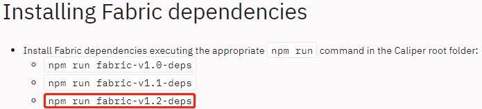

实际上经过实际尝试之后发现npm run fabric-v1.2-deps执行是失败的，并没有这个script。目前只支持：

* npm run fabric-v1.0-deps
* npm run fabric-v1.1-deps
* npm run fabric-deps

注意：npm run fabric-deps安装的实际上是fabric v1.4的package。只需根据待测的fabric版本执行其中一个命令即可。由于我要测试的是fabric v1.4，所以我执行的是npm run fabric-deps。

执行完npm run fabric-deps之后，打印的log显示有几个相关的package安装成功了：grpc@1.14.2，fabric-ca-client@1.4.0，fabric-client@1.4.0，fabric-network@1.4.0

这是个很大的坑，为什么呢？因为虽然log说这几个package安装成功了，实际上并没有安装成功，用以下几个命令可以验证是否安装成功：

* npm list grpc
* npm list fabric-client
* npm list fabric-ca-client
* npm list fabric-network

执行之后发现是空，并没有安装成功。调查之后，发现根本原因是fabric-deps脚本里面使用npm install安装这几个package的时候使用了--no-save参数，这样的话就不会把package实际放入依赖中。

--no-save: Prevents saving to dependencies.

## 显式安装grpc,fabric-client,fabric-ca-client,fabric-network

鉴于上一步的坑儿，需要用命令再显式安装这几个package：

* npm install grpc@1.14.2 --unsafe-perm
* npm install fabric-ca-client@1.4.0 --unsafe-perm
* npm install fabric-client@1.4.0 --unsafe-perm
* npm install fabric-network@1.4.0 --unsafe-perm

安装完之后用npm list再检查一遍是否安装成功。

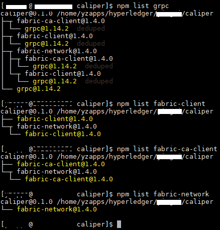

## 跑一个最简单的测试验证之前的所有安装都成功了

在caliper目录下，执行：

    node benchmark/simple/main.js

如果程序顺利跑完，并且生成了一份html的测试报告，说明测试成功，之前所有的安装都没有问题。如果这一步有问题，请从头开始检查哪一步安装出了问题。

注：benchmark/simple/main.js实际上跑的是一个名为simple的测试用例。官网里面说如果不指定-c和-n的参数，默认使用config.json作为benchmark配置文件。实际上说得不对，查看main.js源码之后发现，如果不指定-c参数，默认使用的benchmark配置文件是benchmark/simple/config-linear-rate.yaml；如果不指定-n参数，默认使用的network配置文件是network/fabric-v1.1/2org1peergoleveldb/fabric-node-tls.json。

建议大家可以看一下fabric-node-tls.json文件，实际上就是用docker-compose在caliper所在机器上启动一个包含2个组织（每个组织各1个peer）的fabric网络，然后对其进行测试，本质就是一个单机网络测试，且peer使用的是goleveldb。测试完成之后会删除掉所有的docker容器，清理环境。

这个测试使用的链码也是在fabric-node-tls.json中指定的，链码地址在src/contract/fabric/simple/node，感兴趣的话可以看一看。

## 测试多节点分布式fabric网络

### 前言
重头戏来了，由于大多数情况下，我们都是使用caliper来测试已经搭建好的多节点fabric网络，这样才能有效地对真实的多节点fabric网络的性能进行评估。在这个过程中，遇到了很多大大小小的问题，踩坑记录和大家分享。

我的fabric网络的orderer模式是kafka。zookeeper,kafka,orderer,peer,couchdb,cli是部署在三台机器上的，和caliper所在的机器是分开的。也就是说caliper是fabric网络的测试和监控是远程的。我个人也建议caliper部署在一台单独的机器上，不要和被测的fabric网络混在一起，caliper可以用来测试多个fabric网络，甚至可以测试sawtooth，所以单独选一台机器安装caliper比较合适，安装好之后就不动了，环境也不容易受到被测网络的影响。

### benchmark配置文件

我实际使用的一个benchmark配置文件如下：

[config-marbles-no-rich-query.yaml](https://github.com/CoreyLin/blockchain-blog/blob/master/hyperledger/caliper/config-marbles-no-rich-query.yaml)

其中各个字段代表的含义，可以结合官方文档看，是比较清晰，一目了然的，就不多说了。重点要说一下如下字段：

* monitor-->docker

这个字段非常关键。

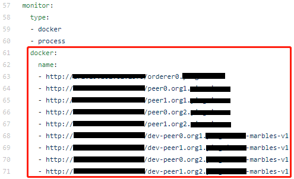

从本质上讲，在测试过程中，caliper一直在对被测fabric网络的各个orderer和peer的docker容器进行监控，收集内存占用、CPU占用等信息。由于被测网络和caliper不在一台机器上，是远程的，所以caliper是通过Docker Remote API对被测网络的容器进行监控的。所以就需要逐个指定需要监控的远程docker容器的信息，比如：

http://ordererip:2375/orderer0.***.com 代表ordererip上name为orderer0.***.com的orderer容器，http://peerip:2375/peer0.org1.***.com 代表peerip上name为peer0.org1.***.com的peer容器，http://peerip:2375/dev-peer0.org1.***.com-marbles-v1 代表peerip上name为dev-peer0.org1.***.com-marbles-v1的chaincode容器。

* rounds-->label

一个label代表一轮测试，在这轮测试里面可以自己定义发送transaction的数量或持续时间，以及发送速率，这个文档里面说得很清楚。

值得一提的是callback这个字段，指定了一个js文件，实际上就是本轮测试用来调用部署在链上的链码的入口文件，这个js文件通过fabric SDK调用链码（智能合约）。

比如，在benchmark/marbles/config.yaml这个benchmark配置文件中，定义了一个label "init"，这个label指向了callback "benchmark/marbles/init.js".

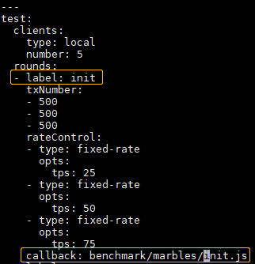

在benchmark/marbles/init.js中，我们又可以看到，它调用了链码marbles(版本为v1)的一个函数initMarble，并且传入了相应的参数：

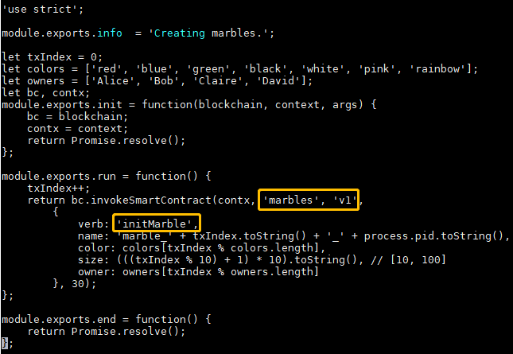

那么链码的部署又是在哪里配置的呢？就是在network配置文件中配置的，比如network/fabric-v1.1/2org1peercouchdb/fabric-node.json

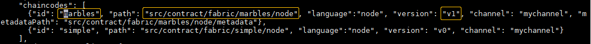

到现在，相信大家已经对测试逻辑很清楚了。

### enable the remote API for dockerd

前面讲了，由于caliper需要远程监控fabric网络的容器，所以需要在被测fabric网络的每台机器上开启远程API，让其监听远程的监控请求。具体开启方法按照docker官方文档操作：

https://success.docker.com/article/how-do-i-enable-the-remote-api-for-dockerd

开启之后，验证是否开启成功，可以在能够访问fabric网络的一台机器的浏览器上访问 [fabric-node-ip]:2375/images/json ，如果访问成功，说明开启remote API成功

### simple chaincode的问题

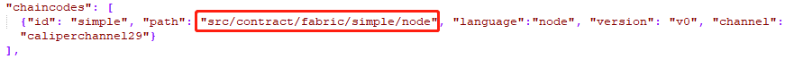

当我在network配置文件中配置安装并实例化simple chaincode时，用node benchmark/simple/main.js运行测试都会出现simple链码在一些peer上实例化timeout的情况，这种情况每次都必现，默认timeout的时间是5分钟，个人认为5分钟实例化一个简单的链码肯定是够的，不知道哪里出了问题。但是如果被测网络是单机环境，实例化就会成功。这个问题很奇怪，我调查过一段时间，无果，由于没有更多时间耗在这上面，就终止了调查。所以建议大家测试多节点网络的时候不要用simple链码。

### marbles chaincode的问题

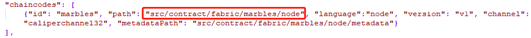

当我在network配置文件中配置安装并实例化marbles chaincode时,用node benchmark/marbles/main.js运行测试后，都会出现label init阶段写数据成功，而label query阶段用rich query string读数据失败的情况，无法测试读数据的性能，debug了很久，包括查看peer log，以及couchdb log，都没有找到太多有用的信息，就是一个timeout，最后无果，时间有限，只能终止调查。所以建议大家可以试一试marbles，如果不行的话就不要用了。

### 使用marbles-norichquery chaincode

在摸索了一段时间之后，发现使用marbles-norichquery chaincode是一个很好的选择，因为这个chaincode写数据每次写入一条json数据，读数据每次也读一条，读写各一条，更有利于标准化和量化，避免在一次链码调用中写入或者读取大量数据，对于benchmark测试来说实际上不好量化。对于benchmark测试，我们通过发送transaction的tps来进行测试，但是对于链码本身的读写，尽量简单，不宜太复杂，因为吞吐量（tps）同样依赖于链码的复杂度。对于不同的fabric网络的测试，链码可以保持一致，仅改变网络配置，这样有利于对比不同网络的性能情况。

* clients number

在benchmark配置文件中，clients number最好设置为默认的5，不要设置为1。设置为1的话就意味着caliper只启动一个client进程来发送transaction与fabric网络进行通信，这一个client就会处理大量的transaction，最后会出现这个client和orderer通信超时的情况，client内部的细节我没时间看源代码，反正测试结果就是这样，会出现超时。如果把clients number设置为5，就不会出现超时，一切正常。

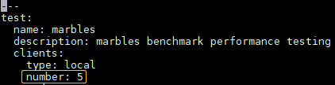

* benchmark配置文件

我实际用的benchmark配置文件如下，请参考：

[config-marbles-no-rich-query.yaml](config-marbles-no-rich-query.yaml)

* network配置文件

这个配置文件是按照实际被测网络进行配置的，不是千篇一律的，需要根据自己的被测网络进行修改，我实际使用的如下，请参考：

[fabric-node-marbles-no-rich-query.json](fabric-node-marbles-no-rich-query.json)

注意：部署的链码是caliper自带的src/contract/fabric/marbles-norichquery/node

* channel配置

channel配置是在network配置文件中，包含一个channel configuration transaction文件，这个文件是用于创建channel的，通过configtxgen生成，比如：

configtxgen -profile TwoOrgsChannel -outputCreateChannelTx ./channel-artifacts/channel.tx -channelID mychannel

生成好之后scp到caliper机器上的任意一个目录中，然后在channel-->config中指定这个文件的相对路径，比如：

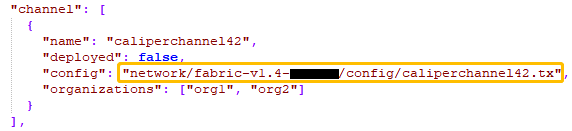

* benchmark测试启动脚本

每一个链码的测试都需要一组对应的js脚本来启动测试，其中包含一个main.js脚本，比如benchmark/marbles中就包含main.js,init.js,query.js三个脚本：

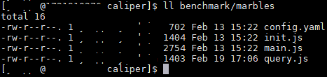

由于caliper没有为marbles-norichquery也准备benchmark脚本，所以需要我们自己来写，可以基于benchmark/marbles里的脚本改一改。单独创建一个目录benchmark/marbles_no_rich_query，把自己开发好的main.js,init.js,query.js放进去。我自己用的脚本如下：

[marbles_no_rich_query](marbles_no_rich_query)

* 运行测试

前面已经准备好了benchmark配置文件、network配置文件、channel配置交易文件、benchmark测试启动脚本，现在就可以跑测试了，在caliper目录下执行命令：

    node benchmark/marbles_no_rich_query/main.js -c [benchmark配置文件的绝对路径] -n [network配置文件的绝对路径]

注意，就用绝对路径，相对路径我试过，有一些问题。

跑完测试用例之后，就可以看到一个生成的html的测试报告，打开之后，测试结果一目了然，throughput,latency信息都有，还有memory,CPU等资源占用信息，很清晰。比如：

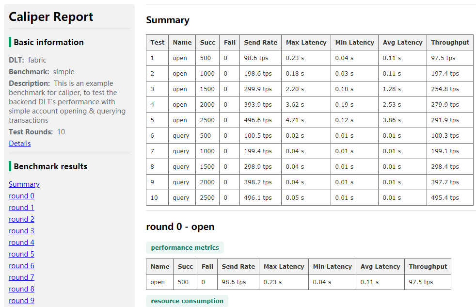

[report-20190219T131935.html](report-20190219T131935.html)

注意：在跑测试的过程中，如果出现实例化链码时超时的现象，千万不要用Ctrl+C退出测试进程，这样做很危险。只能等待测试自己超时，不要人工干预。我之前就因为用Ctrl+C手工退出测试进程，导致在后续测试的时候报"Ledger not opened"的错误，这个错误Google上都查不到原因，只能自己看fabric的源代码，耗时耗力，容易陷进去。个人估计这个错误的产生是由于实例化链码的时候可能已经做了部分操作，但是操作还没完成就被强行退出了，可能在数据库中留下了一些残留数据，导致错误。总之，运行测试的过程中不要人工干预。重要的事情讲三遍。

### 环境清理：

跑完测试之后，需要进行环境清理工作，以便用相同的链码跑下一次测试，具体包括：

* 在被测Fabric的所有peer节点上，删除本次caliper测试过程中由caliper自动创建的链码的容器和一些环境配置相关的容器，比如：

      docker rm dev-peer0.org1.***.com-marbles-v1 dev-peer1.org1.***.com-marbles-v1

* 在被测Fabric的所有peer节点上，进入每个peer的容器，比如：

      docker exec -it peer0.org1.***.com bash
      
  然后删除在跑caliper测试过程中安装的链码，比如：

      rm /var/hyperledger/production/chaincodes/marbles.v1
      
* 为下一次跑caliper测试生成一个新的channel配置交易，比如

      configtxgen -profile TwoOrgsChannel -outputCreateChannelTx ./channel-artifacts/caliperchannel100.tx -channelID caliperchannel100
      
  然后把这个tx文件scp到caliper所在服务器上，放到caliper目录下的某个子目录中，要在caliper网络配置文件中被以相对路径的方式引用，比如：
  
  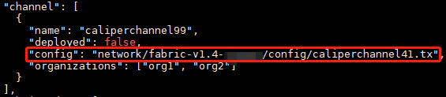
      
  注：根据实践经验，每次跑caliper，需要在一个新的channel上跑，所以需要创建一个新的channel，具体原因不赘述了。

> 如想了解更多内容，请关注微信公众号“Corey区块链技术分享”。
