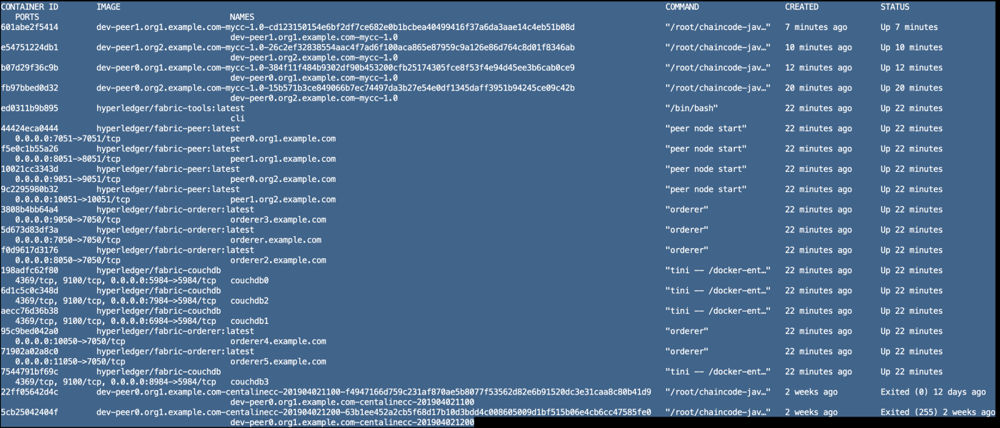

# Hyperledger Fabric Raft实践---尝试Fabric中新添加的共识算法Raft

## 介绍

自从Fabric 1.4.1以来，Fabric支持一种名为Raft的新共识，以前仅仅支持Kafka和Solo。本文根据官方教程Build-Your-First-Network实际地实践一下Raft共识。

注意：稍后，你将看到我关闭一些orderers，其中每个orderer都是一个Raft leader。最后证明在leader节点崩溃的情况下，使用Raft的orderers可以自动重新选择leader

## 设置环境

我们使用Fabric Build-Your-First-Network（ https://hyperledger-fabric.readthedocs.io/en/release-1.4/build_network.html ），环境如下：

* 2个组织
* 5个orderers
* 每个组织各自有2个peers，用的CouchDB
* 用于控制peers和orderers的一个命令行接口CLI
* 一个通道(mychannel)
* 一个简单的链码

首先，按照以下指导准备先决条件:

https://hyperledger-fabric.readthedocs.io/en/release-1.4/prereqs.html

在满足先决条件之后，打开终端，定位到选择的一个路径，例如Desktop。

然后输入以下命令:

    curl -sSL http://bit.ly/2ysbOFE | bash -s -- 1.4.1 1.4.1 0.4.15

此命令用于下载Fabric docker镜像并pull一个包含教程文件的目录fabric-samples。

现在一个接一个地执行下面的命令:

	cd fabric-samples/first-network

	../bin/cryptogen generate --config=./crypto-config.yaml

	export FABRIC_CFG_PATH=$PWD

	../bin/configtxgen -profile SampleMultiNodeEtcdRaft -channelID byfn-sys-channel -outputBlock ./channel-artifacts/genesis.block

	export CHANNEL_NAME=mychannel

	../bin/configtxgen -profile TwoOrgsChannel -outputCreateChannelTx ./channel-artifacts/channel.tx -channelID $CHANNEL_NAME

	../bin/configtxgen -profile TwoOrgsChannel -outputAnchorPeersUpdate ./channel-artifacts/Org1MSPanchors.tx -channelID $CHANNEL_NAME -asOrg Org1MSP

	../bin/configtxgen -profile TwoOrgsChannel -outputAnchorPeersUpdate ./channel-artifacts/Org2MSPanchors.tx -channelID $CHANNEL_NAME -asOrg Org2MSP

	docker-compose -f docker-compose-cli.yaml -f docker-compose-couch.yaml -f docker-compose-etcdraft2.yaml up -d

	docker exec -it cli bash

	CORE_PEER_MSPCONFIGPATH=/opt/gopath/src/github.com/hyperledger/fabric/peer/crypto/peerOrganizations/org1.example.com/users/Admin@org1.example.com/msp
	CORE_PEER_ADDRESS=peer0.org1.example.com:7051
	CORE_PEER_LOCALMSPID="Org1MSP"
	CORE_PEER_TLS_ROOTCERT_FILE=/opt/gopath/src/github.com/hyperledger/fabric/peer/crypto/peerOrganizations/org1.example.com/peers/peer0.org1.example.com/tls/ca.crt

	export CHANNEL_NAME=mychannel

	peer channel create -o orderer.example.com:7050 -c $CHANNEL_NAME -f ./channel-artifacts/channel.tx --tls --cafile /opt/gopath/src/github.com/hyperledger/fabric/peer/crypto/ordererOrganizations/example.com/orderers/orderer.example.com/msp/tlscacerts/tlsca.example.com-cert.pem

	peer channel join -b mychannel.block

	CORE_PEER_MSPCONFIGPATH=/opt/gopath/src/github.com/hyperledger/fabric/peer/crypto/peerOrganizations/org2.example.com/users/Admin@org2.example.com/msp CORE_PEER_ADDRESS=peer0.org2.example.com:9051 CORE_PEER_LOCALMSPID="Org2MSP" CORE_PEER_TLS_ROOTCERT_FILE=/opt/gopath/src/github.com/hyperledger/fabric/peer/crypto/peerOrganizations/org2.example.com/peers/peer0.org2.example.com/tls/ca.crt 

	peer channel join -b mychannel.block

	CORE_PEER_MSPCONFIGPATH=/opt/gopath/src/github.com/hyperledger/fabric/peer/crypto/peerOrganizations/org1.example.com/users/Admin@org1.example.com/msp
	CORE_PEER_ADDRESS=peer0.org1.example.com:7051
	CORE_PEER_LOCALMSPID="Org1MSP"
	CORE_PEER_TLS_ROOTCERT_FILE=/opt/gopath/src/github.com/hyperledger/fabric/peer/crypto/peerOrganizations/org1.example.com/peers/peer0.org1.example.com/tls/ca.crt

	peer channel update -o orderer.example.com:7050 -c $CHANNEL_NAME -f ./channel-artifacts/Org1MSPanchors.tx --tls --cafile /opt/gopath/src/github.com/hyperledger/fabric/peer/crypto/ordererOrganizations/example.com/orderers/orderer.example.com/msp/tlscacerts/tlsca.example.com-cert.pem

	CORE_PEER_MSPCONFIGPATH=/opt/gopath/src/github.com/hyperledger/fabric/peer/crypto/peerOrganizations/org2.example.com/users/Admin@org2.example.com/msp CORE_PEER_ADDRESS=peer0.org2.example.com:9051 CORE_PEER_LOCALMSPID="Org2MSP" CORE_PEER_TLS_ROOTCERT_FILE=/opt/gopath/src/github.com/hyperledger/fabric/peer/crypto/peerOrganizations/org2.example.com/peers/peer0.org2.example.com/tls/ca.crt 

	peer channel update -o orderer.example.com:7050 -c $CHANNEL_NAME -f ./channel-artifacts/Org2MSPanchors.tx --tls --cafile /opt/gopath/src/github.com/hyperledger/fabric/peer/crypto/ordererOrganizations/example.com/orderers/orderer.example.com/msp/tlscacerts/tlsca.example.com-cert.pem

	peer chaincode install -n mycc -v 1.0 -l java -p /opt/gopath/src/github.com/chaincode/chaincode_example02/java/

	peer chaincode instantiate -o orderer.example.com:7050 --tls --cafile /opt/gopath/src/github.com/hyperledger/fabric/peer/crypto/ordererOrganizations/example.com/orderers/orderer.example.com/msp/tlscacerts/tlsca.example.com-cert.pem -C $CHANNEL_NAME -n mycc -l java -v 1.0 -c '{"Args":["init","a", "100", "b","200"]}' -P "AND ('Org1MSP.peer','Org2MSP.peer')"

	CORE_PEER_MSPCONFIGPATH=/opt/gopath/src/github.com/hyperledger/fabric/peer/crypto/peerOrganizations/org1.example.com/users/Admin@org1.example.com/msp
	CORE_PEER_ADDRESS=peer0.org1.example.com:7051
	CORE_PEER_LOCALMSPID="Org1MSP"
	CORE_PEER_TLS_ROOTCERT_FILE=/opt/gopath/src/github.com/hyperledger/fabric/peer/crypto/peerOrganizations/org1.example.com/peers/peer0.org1.example.com/tls/ca.crt

	peer chaincode install -n mycc -v 1.0 -l java -p /opt/gopath/src/github.com/chaincode/chaincode_example02/java/

	peer chaincode query -C $CHANNEL_NAME -n mycc -c '{"Args":["query","a"]}'

	peer chaincode invoke -o orderer.example.com:7050 --tls true --cafile /opt/gopath/src/github.com/hyperledger/fabric/peer/crypto/ordererOrganizations/example.com/orderers/orderer.example.com/msp/tlscacerts/tlsca.example.com-cert.pem -C $CHANNEL_NAME -n mycc --peerAddresses peer0.org1.example.com:7051 --tlsRootCertFiles /opt/gopath/src/github.com/hyperledger/fabric/peer/crypto/peerOrganizations/org1.example.com/peers/peer0.org1.example.com/tls/ca.crt --peerAddresses peer0.org2.example.com:9051 --tlsRootCertFiles /opt/gopath/src/github.com/hyperledger/fabric/peer/crypto/peerOrganizations/org2.example.com/peers/peer0.org2.example.com/tls/ca.crt -c '{"Args":["invoke","a","b","10"]}'

	peer chaincode query -C $CHANNEL_NAME -n mycc -c '{"Args":["query","a"]}'

	CORE_PEER_MSPCONFIGPATH=/opt/gopath/src/github.com/hyperledger/fabric/peer/crypto/peerOrganizations/org2.example.com/users/Admin@org2.example.com/msp
	CORE_PEER_ADDRESS=peer1.org2.example.com:10051
	CORE_PEER_LOCALMSPID="Org2MSP"
	CORE_PEER_TLS_ROOTCERT_FILE=/opt/gopath/src/github.com/hyperledger/fabric/peer/crypto/peerOrganizations/org2.example.com/peers/peer1.org2.example.com/tls/ca.crt

	peer chaincode install -n mycc -v 1.0 -l java -p /opt/gopath/src/github.com/chaincode/chaincode_example02/java/

	peer channel join -b mychannel.block

	CORE_PEER_MSPCONFIGPATH=/opt/gopath/src/github.com/hyperledger/fabric/peer/crypto/peerOrganizations/org1.example.com/users/Admin@org1.example.com/msp
	CORE_PEER_ADDRESS=peer1.org1.example.com:8051
	CORE_PEER_LOCALMSPID="Org1MSP"
	CORE_PEER_TLS_ROOTCERT_FILE=/opt/gopath/src/github.com/hyperledger/fabric/peer/crypto/peerOrganizations/org1.example.com/peers/peer1.org1.example.com/tls/ca.crt

	peer chaincode install -n mycc -v 1.0 -l java -p /opt/gopath/src/github.com/chaincode/chaincode_example02/java/

	peer channel join -b mychannel.block

	CORE_PEER_MSPCONFIGPATH=/opt/gopath/src/github.com/hyperledger/fabric/peer/crypto/peerOrganizations/org1.example.com/users/Admin@org1.example.com/msp
	CORE_PEER_ADDRESS=peer0.org1.example.com:7051
	CORE_PEER_LOCALMSPID="Org1MSP"
	CORE_PEER_TLS_ROOTCERT_FILE=/opt/gopath/src/github.com/hyperledger/fabric/peer/crypto/peerOrganizations/org1.example.com/peers/peer0.org1.example.com/tls/ca.crt

如果你认为上面的命令太多，你可以只输入一个命令来替代上面的所有命令，结果是等效的:

./byfn.sh up -o etcdraft -l java -s couchdb

## 列出现有的节点

设置好环境后，我们将查看网络中正在运行的节点。

	exit

	docker ps -a

下面是正在运行的容器列表

我们能看到orderer.example.com, orderer2.example.com等等容器在运行（NAMES一栏）。可以看到，由于采用了Raft共识，就没有Kafka,Zookeeper容器了。

我们总共有5个orderers，因此Raft中有5个节点。

## 杀掉一个Raft leader

接下来，我将关闭一个Raft leader，然后看看Raft网络会发生什么。

在杀掉之前，让我们先看看哪个orderer是当前的Raft leader。

	docker logs orderer3.example.com

在我的机器上，观察到以下日志:

	[orderer.consensus.etcdraft] start -> INFO 03b Starting raft node as part of a new channel channel=mychannel node=3
	[...]
	[orderer.consensus.etcdraft] serveRequest -> INFO 05d Raft leader changed: 0 -> 3 channel=mychannel node=3

如果你不能看到类似的日志，不要担心，再尝试几次“docker logs orderer3.example.com”命令，或者稍后再尝试(例如10-20秒后)。

orderer3是Raft节点3，当前的leader是节点3。也就是说，在我的环境中，orderer3是当前的Raft leader。

接下来把它杀掉：

	docker stop orderer3.example.com

然后，观察来自另一个orderer的日志:

	docker logs orderer2.example.com

在我的环境中，观察到

	[orderer.consensus.etcdraft] serveRequest -> INFO 05a Raft leader changed: 0 -> 1 channel=mychannel node=2

现在节点1(应该是orderer.example.com)是新的Raft leader，它将自动重新当选。

但是为了证明网络仍然正常工作，让我们执行一些交易:

	docker exec -it cli bash
	
	export CHANNEL_NAME=mychannel
	
	peer chaincode query -C $CHANNEL_NAME -n mycc -c '{"Args":["query","a"]}'
	
	// 然后得到90，或者别的数
	peer chaincode invoke -o orderer.example.com:7050 --tls true --cafile /opt/gopath/src/github.com/hyperledger/fabric/peer/crypto/ordererOrganizations/example.com/orderers/orderer.example.com/msp/tlscacerts/tlsca.example.com-cert.pem -C $CHANNEL_NAME -n mycc --peerAddresses peer0.org1.example.com:7051 --tlsRootCertFiles /opt/gopath/src/github.com/hyperledger/fabric/peer/crypto/peerOrganizations/org1.example.com/peers/peer0.org1.example.com/tls/ca.crt --peerAddresses peer0.org2.example.com:9051 --tlsRootCertFiles /opt/gopath/src/github.com/hyperledger/fabric/peer/crypto/peerOrganizations/org2.example.com/peers/peer0.org2.example.com/tls/ca.crt -c '{"Args":["invoke","a","b","10"]}'
	
	peer chaincode query -C $CHANNEL_NAME -n mycc -c '{"Args":["query","a"]}'
	
	// 然后应该得到80，或者一个与上一次查询结果不同的数字，这样证明网络可以正常工作
	
## 再次杀掉一个Raft leader

再杀掉一个leader看看会发生什么。记住，当前的leader是node 1，即orderer.example.com。

	exit
	
	docker stop orderer.example.com
	
	// 现在观察来自另一个orderer的日志
	docker logs orderer4.example.com
	[orderer.consensus.etcdraft] serveRequest -> INFO 087 Raft leader changed: 0 -> 4 channel=mychannel node=4

在我的环境中，现在新的重新当选的leader现在是node 4(它应该是orderer4.example.com)。

## 第三次杀掉一个Raft leader
	docker stop orderer4.example.com
	// 现在观察来自另一个orderer的日志
	docker logs orderer2.example.com

这次的log没有新的leader当选(没有新的选举日志出现)，为什么呢?出了什么问题？

在Raft中，为了保证网络的正常运行，需要保持多数的orderers在线。在我们的例子中，我们有5个orderers，而我杀死了其中的3个，多数原则（majority rule）被打破了。

## 修复Raft

让我们打开一个stopped orderer，从而修复多数原则:

	docker start orderer4.example.com
	docker logs orderer4.example.com
	// 会观察到这样的日志
	[orderer.consensus.etcdraft] serveRequest -> INFO 0ab Raft leader changed: 0 -> 2 channel=mychannel node=4

一旦多数原则满足了，re-election过程就会恢复正常。

## 结论

orderers可以在leader节点崩溃的情况下，自动重新选择leader，前提是多数orderers都在线。

## 补充

在 https://github.com/hyperledger/fabric-samples/blob/master/first-network/configtx.yaml 中，etcdraft的配置体现如下

    SampleMultiNodeEtcdRaft:
        <<: *ChannelDefaults
        Capabilities:
            <<: *ChannelCapabilities
        Orderer:
            <<: *OrdererDefaults
            OrdererType: etcdraft
            EtcdRaft:
                Consenters:
                - Host: orderer.example.com
                  Port: 7050
                  ClientTLSCert: crypto-config/ordererOrganizations/example.com/orderers/orderer.example.com/tls/server.crt
                  ServerTLSCert: crypto-config/ordererOrganizations/example.com/orderers/orderer.example.com/tls/server.crt
                - Host: orderer2.example.com
                  Port: 7050
                  ClientTLSCert: crypto-config/ordererOrganizations/example.com/orderers/orderer2.example.com/tls/server.crt
                  ServerTLSCert: crypto-config/ordererOrganizations/example.com/orderers/orderer2.example.com/tls/server.crt
                - Host: orderer3.example.com
                  Port: 7050
                  ClientTLSCert: crypto-config/ordererOrganizations/example.com/orderers/orderer3.example.com/tls/server.crt
                  ServerTLSCert: crypto-config/ordererOrganizations/example.com/orderers/orderer3.example.com/tls/server.crt
                - Host: orderer4.example.com
                  Port: 7050
                  ClientTLSCert: crypto-config/ordererOrganizations/example.com/orderers/orderer4.example.com/tls/server.crt
                  ServerTLSCert: crypto-config/ordererOrganizations/example.com/orderers/orderer4.example.com/tls/server.crt
                - Host: orderer5.example.com
                  Port: 7050
                  ClientTLSCert: crypto-config/ordererOrganizations/example.com/orderers/orderer5.example.com/tls/server.crt
                  ServerTLSCert: crypto-config/ordererOrganizations/example.com/orderers/orderer5.example.com/tls/server.crt
            Addresses:
                - orderer.example.com:7050
                - orderer2.example.com:7050
                - orderer3.example.com:7050
                - orderer4.example.com:7050
                - orderer5.example.com:7050

            Organizations:
            - *OrdererOrg
            Capabilities:
                <<: *OrdererCapabilities
