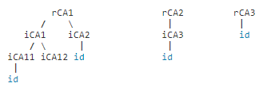

# MSP标识有效性规则

正如在MSP描述中提到的，MSP可以配置一组根证书颁发机构(rCAs)和一组中间证书颁发机构(iCAs)。一个MSP的iCA证书必须由这个MSP的**一个**rCAs或iCAs签署。一个MSP的配置可以包含一个证书撤销列表(certificate revocation list, CRL)。如果CRL中列出了MSP的任何根证书颁发机构，那么MSP的配置必须不包含CRL中包含的任何iCA，否则MSP设置将失败。

每个rCA都是一个认证树的根。也就是说，每个rCA可能是一个或多个iCAs证书的签名者，这些iCAs将是其他iCAs或用户证书的签名者。这里有几个例子:

默认的MPS实现接受由适当CA签署的有效标识X.509证书。在上面的图表中，只有iCA11, iCA12, iCA2, iCA3, 和 rCA3签署的证书才被认为是有效的。由内部节点签名的证书将被拒绝。

请注意，如果在MSP配置中指定了一个或多个组织单元，证书的有效性也会受到类似的影响。回想一下，在一个MSP配置中，一个组织单元被指定为两个值的对（parent-cert, ou-string），分别表示认证该组织单元的证书颁发机构和实际的组织单元标识符。如果证书C由在MSP配置中指定了组织单元的iCA或rCA签署，那么在其他需求中，如果证书C包含ou-string作为其OU字段的一部分，则认为证书C是有效的。
