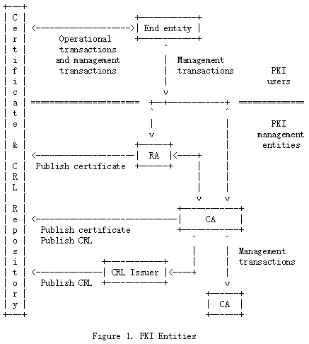

# Internet X.509公钥基础设施证书(Public Key Infrastructure Certificate)和证书撤销列表(Certificate Revocation List,CRL)Profile

## 3.方法综述

下面是使用X.509 (PKIX)规范的公钥基础设施所假设的架构模型的一个简化视图。
 
该模型的组成部分为:

* end entity（终端实体）: PKI证书的用户和/或终端用户系统，该终端用户系统是一个证书的主体

* CA: 证书颁发机构

* RA: 注册机构。比如一个可选的系统，一个CA将某些管理功能委托给该系统

* CRL issuer（CRL发行者）: 生成CRLs并对其进行签名的系统

* repository（仓库）: 存储证书和CRLs的一个系统或分布式系统的集合，用作将这些证书和CRLs分发给终端实体的一种方法

CAs负责指示它们发出的证书的撤销状态。撤销状态信息可以使用在线证书状态协议(Online Certificate Status Protocol,OCSP) [RFC2560]、证书撤销列表(certificate revocation lists,CRLs)或其他一些机制提供。通常，当使用CRL提供撤销状态信息时，CA也是CRL的发行者。但是，一个CA可以将发行CRLs的责任委托给一个不同的实体。

注意，一个属性机构(Attribute Authority，AA)也可能选择将CRLs的发行委托给一个CRL发行者。

### 3.1.X.509版本3证书

一个公钥的用户需要对这一点有信心：此公钥关联的私钥由正确的远程主体(人或系统)拥有。通常主体使用一种加密或数字签名机制。这种信心是通过使用公钥证书获得的，公钥证书是将公钥值绑定到主体的数据结构。这种绑定由受信任的CA对每个证书进行数字签名来声明。CA可将声明基于技术手段(如通过质询-回应协议的拥有证明)、私钥的表示或主体的声明。证书的有效生命周期有限，这在其签名内容中表示。由于证书的签名和及时性可以由使用证书的客户端独立检查，因此可以通过不受信任的通信和服务器系统分发证书，并且可以缓存在使用证书的系统的不安全存储中。

ITU-T X.509(前CCITT X.509)或ISO/IEC 9594-8于1988年首次作为X.500目录建议的一部分发布，定义了一种标准证书格式[X.509]。1988年标准中的证书格式称为version 1 (v1)格式。在1993年修订X.500时，又添加了两个字段，形成了version 2 (v2)格式。

1993年发布的Internet Privacy Enhanced Mail (PEM) RFC包括基于X.509 v1证书的公钥基础设施规范[RFC1422]。部署RFC 1422所获得的经验表明，v1和v2证书格式在几个方面存在缺陷。最重要的是，需要更多的字段来携带PEM设计和实现经验证明是必要的信息。为了响应这些新要求，ISO/IEC、ITU-T和ANSI X9开发了X.509版本3 (v3)证书格式。v3格式通过添加额外扩展字段扩展了v2格式。特定的扩展字段类型可以在标准中指定，也可以由任何组织或社区定义和注册。1996年6月，基本v3格式的标准化工作完成[X.509]。

ISO/IEC、ITU-T和ANSI X9还开发了v3扩展字段中使用的标准扩展[X.509][X9.55]。这些扩展可以传递诸如附加的主体标识信息、关键属性信息、策略信息和认证路径约束等数据。然而，ISO/IEC、ITU-T和ANSI X9标准扩展的适用性非常广泛。为了开发用于Internet的X.509 v3系统的互操作实现，有必要指定一个profile来使用为Internet量身定制的X.509 v3扩展。本文档的目标之一是为Internet WWW、电子邮件和IPsec应用程序指定profile。具有附加需求的环境可以构建在此profile之上，也可以替换它。

### 3.2.认证路径和信任

需要一个公钥知识的安全服务的一个用户通常需要获取和验证一个包含所需公钥的证书。如果公钥用户尚未持有签署证书的CA的公钥的可靠副本、CA的名称和相关信息(例如有效期或名称约束)，那么它可能需要额外的证书来获得该公钥。通常，可能需要一个多证书链，包括由一个CA签名的公钥所有者(最终实体)的证书，以及由其他CA签名的零个或多个额外的CA证书。之所以需要这样的链(称为认证路径)，是因为一个公钥用户只被数量有限的可靠的CA公钥初始化。

为了让公钥用户能够找到认证路径，可以采用不同的方式配置CAs。对于PEM, RFC 1422定义了一个严格的CAs层次结构。有三类PEM CA:

1. 互联网策略注册机构（IPRA）:该机构在互联网协会的支持下运作，是第一级PEM认证体系的基础。它只向下一级主管部门PCAs颁发证书。所有认证路径都以IPRA开始。

2. 策略认证机构(PCAs): PCAs位于层次结构的第2级，每个PCA都由IPRA认证。PCA应制定并公布其关于核证用户或下级核证机关的策略声明。不同的PCAs旨在满足不同的用户需求。例如，一个PCA(组织PCA)可能支持商业组织的一般电子邮件需求，而另一个PCA(高可信度PCA)可能有更严格的策略，以满足具有法律约束力的数字签名需求。

3. 认证机构(CAs): CAs位于层次结构的第3级，也可以位于更低的级别。3级通过PCAs认证。例如，CA代表特定的组织、特定的组织单元(例如，部门、组)或特定的地理区域。
   
RFC 1422还有一个名称从属规则，该规则要求CA只能为名称从属于CA本身名称的实体颁发证书(在X.500命名树中)。与PEM认证路径关联的信任由PCA名称隐含表示。名称从属规则确保PCA下面的CA受到它们可以证明的从属实体集的合理约束(例如，一个组织的CA只能证明该组织名称树中的实体)。证书用户系统能够机械地检查是否遵循了名称从属规则。

RFC 1422使用X.509 v1证书格式。X.509 v1的限制要求实施一些结构性限制，以便清楚地关联策略信息或限制证书的效用。这些限制包括:

1. 一个纯自顶向下的层次结构，所有认证路径都从IPRA开始;

2. 限制CA主体名称的命名从属规则

3. 使用PCA概念，这需要将单个PCAs的知识构建到证书链验证逻辑中。要确定一个链是否可以被接受，需要了解单个PCAs的知识。

对于X.509 v3, RFC 1422解决的大多数需求都可以使用证书扩展来解决，而不需要限制使用的CA结构。特别是，与证书策略相关的证书扩展消除了对PCAs的需要，约束扩展消除了对名称从属规则的需要。因此，X.509 v3支持更灵活的架构，包括:

1. 认证路径以用户自己域中CA的公钥开始，或者以层次结构顶部的公钥开始。从用户自己域中CA的公钥开始具有一定的优势。在某些环境中，本地域是最受信任的。

2. 可以通过在证书中显式包含名称约束扩展来施加名称约束，但不是必需的。

3. 策略扩展和策略映射取代了PCA概念，这允许更大程度的自动化。应用程序可以根据证书的内容而不是PCAs的先验知识来确定认证路径是否可以接受。这允许认证路径处理的自动化。

X.509 v3还包含一个扩展，它将证书的主体标识为CA或最终实体，从而减少了对PEM中所需的带外信息的依赖。

该规范包括两类证书:CA证书和最终实体证书。CA证书可以进一步分为三类:交叉证书、自签发证书和自签名证书。交叉证书这样一种CA证书，其中颁发者和主体是不同的实体。交叉证书描述了两个CA之间的信任关系。自签发证书是CA证书，其中颁发者和主体是同一实体。生成自签发的证书来支持策略或操作的更改。自签名证书就是自签发的证书，只是多了一个特点：其中数字签名可以通过绑定到证书中的公钥进行验证。自签名证书用于传递一个用于开始认证路径的公钥。最终实体证书颁发给没有被授权颁发证书的主体。

### 3.3.撤销

当颁发证书时，它应该在整个有效期内使用。但是，各种情况都可能导致证书在有效期满之前失效。这种情况包括更改名称、更改主体和CA之间的关联(例如，雇员终止与组织的雇佣关系)，以及对相应私钥的折衷或怀疑折衷。在这种情况下，CA需要撤销证书。

X.509定义了证书撤销的一种方法。这种方法涉及到每个CA定期发出一个名为证书撤销列表(certificate revocation list, CRL)的签名数据结构。CRL是一个带有时间戳的列表，用于标识由CA或CRL发布方签名并在公共存储库中免费提供的已撤销证书。每个被撤销的证书在CRL中由其证书序列号标识。当使用证书的系统使用证书(例如，用于验证远程用户的数字签名)时，该系统不仅检查证书签名和有效性，还获得适当的最新CRL，并检查证书序列号不在该CRL上。“适当的最新”的含义可能因当地政策而异，但通常指最近发布的CRL。一个新的CRL是定期发布的(例如，每小时，每天，或每周)。一个条目被添加到CRL中，作为撤销通知之后的下一次更新的一部分。在被吊销证书的有效期之后，在定期发出的CRL上出现条目之前，不能从CRL中删除条目。

这种撤销方法的一个优点是，CRL可以使用与证书本身完全相同的方式分发，即通过不可信的服务器和不可信的通信。

使用不可信通信和服务器的CRL撤销方法的一个限制是，撤销的时间粒度限制在CRL发布期间。例如,如果一个撤销现在被报道,撤销会被不可靠地通知到certificate-using系统直到所有目前发行的CRL将被更新,这可能是一个小时,一天或一个星期，这取决于CRL发行的频率。

与X.509 v3证书格式一样，为了促进来自多个供应商的可互操作实现，需要对X.509 v2 CRL格式进行profiled以供Internet使用。指定该profile是本文档的目标之一。但是，这个profile不需要CRL的发行。支持在线撤销通知的消息格式和协议在其他PKIX规范中定义。在线撤销通知方法可以作为X.509 CRL的替代方法，在某些环境中适用。在线撤销检查可以显著减少一个撤销报告与将这个信息分发给依赖方之间的延迟。一旦CA接受撤销报告为真实有效的，对在线服务的任何查询都将正确地反映撤销对证书验证的影响。然而，这些方法带来了新的安全需求:证书验证器需要信任在线验证服务，而存储库则不需要信任。

### 3.4.操作协议

向使用证书的客户端系统传递证书和CRL(或状态信息)需要操作协议。需要为各种不同的证书和CRL传递方式提供相应的规范，包括基于LDAP、HTTP、FTP和X.500的分发过程。支持这些功能的操作协议在其他PKIX规范中定义。这些规范可能包括支持所有上述操作环境的消息格式和过程的定义，包括对适当MIME内容类型的定义或引用。

### 3.5.管理协议

需要管理协议来支持PKI用户和管理实体之间的在线交互。例如，可以在一个CA和一个与密钥对关联的客户端系统之间使用管理协议，或者在两个互相交叉认证的CA之间使用管理协议。管理协议可能需要支持的功能包括:

1. 注册:在CA为该用户颁发一个或多个证书之前，用户首先向CA(直接或通过RA)表明自己的身份。

2. 初始化:在客户端系统能够安全运行之前，有必要安装密钥材料，这些密钥与存储在基础设施中其他位置的密钥具有适当的关系。例如，需要使用可信CA的公钥和CA的其他可靠信息安全地初始化客户端，以用于验证证书路径。此外，客户端通常需要用自己的密钥对初始化。

3. 认证:这是CA为用户的公钥颁发证书，并将该证书返回给用户的客户端系统和/或在存储库中发布该证书的过程。

4. 密钥对恢复:作为一个可选项，用户客户端密钥材料(例如用于加密目的的用户私钥)可以由CA或密钥备份系统进行备份。如果用户需要恢复这些备份的密钥材料(例如，由于忘记了密码或丢失了密钥链文件)，可能需要一个在线协议交换来支持这种恢复。

5. 密钥对更新:所有密钥对都需要定期更新，即，以一个新密钥对来替换，并被颁发新证书。

6. 撤销请求:授权人将需要撤销证书的异常情况通知CA。

7. 交叉认证:两个CAs交换用于建立交叉证书的信息。交叉证书是由一个CA颁发给另一个CA的证书，其中包含用于颁发证书的CA签名密钥。

注意，在线协议不是实现上述功能的唯一方法。对于所有功能，都有离线方法来实现相同的结果，本规范不强制使用在线协议。例如，当使用硬件令牌时，许多功能可以作为物理令牌交付的一部分实现。此外，上述一些功能可以组合成一个协议交换。特别是，可以将两个或多个注册、初始化和认证功能合并到一个协议交换中。PKIX系列规范定义了一组支持上述功能的标准消息格式。在这些规范中描述了在不同环境(例如电子邮件、文件传输和WWW)中传输这些消息的协议。

## 4.证书和证书扩展配置文件

本节介绍公钥证书的profile，它将促进互操作性和可重用的PKI。本节基于X.509 v3证书格式和[X.509]中定义的标准证书扩展名。ISO/IEC和ITU-T文件使用1997年版的ASN.1;虽然本文档使用1988 ASN.1语法，但是经过编码的证书和标准扩展名是等价的。本节还定义了支持Internet社区PKI所需的私有扩展。

证书可以在广泛的应用程序和环境中使用，包括广泛的互操作性目标和更广泛的操作和保证需求。本文档的目标是为需要广泛互操作性和有限的特殊用途需求的通用应用程序建立一个公共基线。特别地，重点将是支持使用X.509 v3证书来处理非正式的Internet电子邮件、IPsec和WWW应用程序。

### 4.1.基本的证书字段

X.509 v3证书的基本语法如下所示。对于签名计算，要签名的数据使用ASN.1区分编码规则(distinguished encoding rules, DER) [X.690]进行编码。ASN.1 DER编码是对每个元素的标记(tag)、长度(length)和值(value)的一个编码系统。

	Certificate  ::=  SEQUENCE  {
		 tbsCertificate       TBSCertificate,
		 signatureAlgorithm   AlgorithmIdentifier,
		 signatureValue       BIT STRING  }

	TBSCertificate  ::=  SEQUENCE  {
		 version         [0]  EXPLICIT Version DEFAULT v1,
		 serialNumber         CertificateSerialNumber,
		 signature            AlgorithmIdentifier,
		 issuer               Name,
		 validity             Validity,
		 subject              Name,
		 subjectPublicKeyInfo SubjectPublicKeyInfo,
		 issuerUniqueID  [1]  IMPLICIT UniqueIdentifier OPTIONAL,
							  -- If present, version MUST be v2 or v3
		 subjectUniqueID [2]  IMPLICIT UniqueIdentifier OPTIONAL,
							  -- If present, version MUST be v2 or v3
		 extensions      [3]  EXPLICIT Extensions OPTIONAL
							  -- If present, version MUST be v3
		 }

	Version  ::=  INTEGER  {  v1(0), v2(1), v3(2)  }

	CertificateSerialNumber  ::=  INTEGER

	Validity ::= SEQUENCE {
		 notBefore      Time,
		 notAfter       Time }

	Time ::= CHOICE {
		 utcTime        UTCTime,
		 generalTime    GeneralizedTime }

	UniqueIdentifier  ::=  BIT STRING

	SubjectPublicKeyInfo  ::=  SEQUENCE  {
		 algorithm            AlgorithmIdentifier,
		 subjectPublicKey     BIT STRING  }

	Extensions  ::=  SEQUENCE SIZE (1..MAX) OF Extension

	Extension  ::=  SEQUENCE  {
		 extnID      OBJECT IDENTIFIER,
		 critical    BOOLEAN DEFAULT FALSE,
		 extnValue   OCTET STRING
					 -- contains the DER encoding of an ASN.1 value
					 -- corresponding to the extension type identified
					 -- by extnID
		 }

下面的项目描述了用于Internet的X.509 v3证书。

#### 4.1.1.证书字段

证书是由三个必需字段组成的一个序列（SEQUENCE）。下面的小节将详细描述这些字段。

##### 4.1.1.1.tbsCertificate

这个字段包含主体和发行者的名称、与主体关联的一个公钥、一个有效期和其他关联信息。字段的详细描述见第4.1.2节;tbsCertificate通常包括扩展，如第4.2节所述。

##### 4.1.1.2.signatureAlgorithm

signatureAlgorithm字段包含CA用于签署此证书的密码算法的标识符。[RFC3279]、[RFC4055]和[RFC4491]列出了支持的签名算法，但也可能支持其他签名算法。

一个算法标识符被定义为如下ASN.1结构:

	AlgorithmIdentifier  ::=  SEQUENCE  {
		 algorithm               OBJECT IDENTIFIER,
		 parameters              ANY DEFINED BY algorithm OPTIONAL  }
		 
算法标识符用于标识一种密码算法。OBJECT IDENTIFIER组件标识算法(例如DSA with SHA-1)。可选参数字段的内容将根据所标识的算法而变化。

该字段必须包含与tbsCertificate序列中的signature字段相同的算法标识符(第4.1.2.3节)。

##### 4.1.1.3.signatureValue

signatureValue字段包含基于ASN.1 DER编码的tbsCertificate计算的一个数字签名。使用ASN.1 DER编码的tbsCertificate作为签名函数的输入。这个签名值被编码为一个BIT STRING并包含在signature字段中。对于[RFC3279]、[RFC4055]和[RFC4491]中列出的每个算法，都指定了这个过程的详细信息。

通过生成这个签名，一个CA验证tbsCertificate字段中的信息的有效性。特别是，CA对公钥材料与证书主体之间的绑定进行了验证。

#### 4.1.2.TBSCertificate

TBSCertificate序列包含与证书主体和颁发证书的CA相关的信息。每个TBSCertificate包含主体和发行者的名称、与主体关联的一个公钥、一个有效期、一个版本号和一个序列号;有些可能包含可选的惟一标识符字段。本节的剩余部分将描述这些字段的语法和语义。一个TBSCertificate通常包括扩展。Internet PKI的扩展在第4.2节中进行了描述。

##### 4.1.2.1.Version

此字段描述已编码证书的版本。当使用扩展时，如本profile所述，版本号必须为3(值为2)。如果没有使用扩展，但是存在一个UniqueIdentifier，版本号应该为2(值为1);但是，版本号也可能是3。如果只有基本字段，版本号应该是1(该值从证书中作为默认值省略);但是，版本号也可能是2或3。

具体实现应该准备好接受任何版本的证书。至少，符合标准的实现必须识别版本3的证书。

基于此profile的实现不期望生成版本2的证书。

##### 4.1.2.2.Serial Number

序列号必须是CA分配给每个证书的一个正整数。对于由一个给定CA颁发的每个证书，序列号必须是唯一的，即发行者名称和序列号标识一个唯一的证书。CAs必须强制serialNumber为一个非负整数。

考虑到上面的唯一性要求，序列号可以包含长整数。证书用户必须能够处理最多20 octets的序列号值。符合要求的CAs不能使用超过20 octets的序列号值。

注:不符合规定的CAs可以签发序列号为负数或零的证书。证书用户应该准备好优雅地处理这些证书。

##### 4.1.2.3.Signature

此字段包含CA用于签署这个证书的算法的算法标识符。

该字段必须包含与序列证书中的signatureAlgorithm字段相同的算法标识符(第4.1.1.2节)。可选参数字段的内容将根据所标识的算法而变化。[RFC3279]、[RFC4055]和[RFC4491]列出了支持的签名算法，但也可能支持其他签名算法。

##### 4.1.2.4.Issuer

发行者字段标识签署和颁发这个证书的实体。发行者字段必须包含一个非空的专有名称(DN)。发行者字段定义为X.501类型名称（Name）[X.501]。名称由以下ASN.1结构定义:

