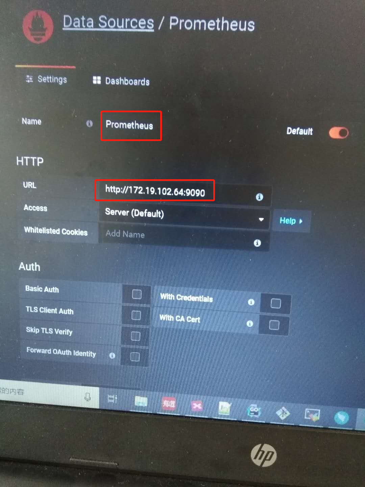
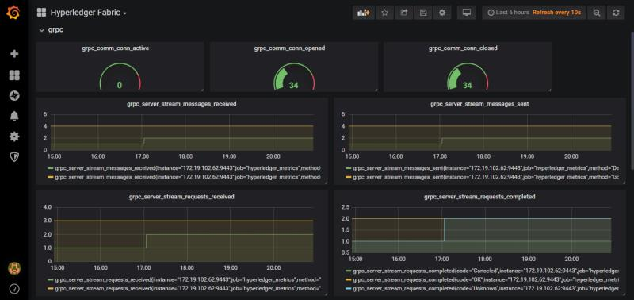

# 搭建prometheus和grafana监控Fabric网络

peer和orderer都承载了一个HTTP服务器，该服务器提供RESTful的“运维”API。这个API与Fabric网络服务无关，它的目的是供运维人员使用，而不是供网络管理员或“用户”使用。我们可以对其进行配置，使其支持prometheus的度量指标，这些指标用于对Fabric网络进行度量，比如grpc,peer,orderer,gossip等等。

## 1.对单个peer配置prometheus运维服务

在peer的docker compose yaml文件中配置如下几个环境变量

* CORE_OPERATIONS_LISTENADDRESS=:9443

	peer和orderer提供的REST运维服务默认是9443端口

* CORE_TLS_ENABLED=false
	
	先暂时关闭TLS

* CORE_METRICS_PROVIDER=prometheus

由于9443是容器内的端口，还需要配置端口映射，暴露这个端口

	9443:9443
	
如果两个peer在一个服务器上，注意端口冲突的问题，另一个peer可以配置为10443:9443
	
    environment:
      - CORE_OPERATIONS_LISTENADDRESS=:9443
      - CORE_TLS_ENABLED=false
      - CORE_METRICS_PROVIDER=prometheus
    ports:
      - 9443:9443

然后用docker-compose up -d命令启动peer。启动之后用如下命令测试是否运维服务启动成功

	curl http://[ip_address]:9443/logspec

	curl http://[ip_address]:9443/healthz

	curl http://[ip_address]:9443/metrics
	
对orderer来说，也是类似的配置，但端口是8443

    environment:
      - ORDERER_OPERATIONS_LISTENADDRESS=:8443
      - ORDERER_TLS_ENABLED=false
      - ORDERER_METRICS_PROVIDER=prometheus
    ports:
      - 8443:8443
	
## 2.部署prometheus服务

### 2.1.下载并解压

去https://prometheus.io/download/下载最新稳定版本的prometheus压缩包，存放在一个单独的prometheus文件夹中。

解压并进入相应文件夹

	tar xvfz prometheus-*.tar.gz

	cd prometheus-*
	
### 2.2.修改配置文件
	
这时在文件夹中有一个默认的prometheus配置文件prometheus.yml，把其内容改成如下配置，使其监控刚刚配置好运维服务的peer

	# my global config
	global:
	  scrape_interval:     15s # Set the scrape interval to every 15 seconds. Default is every 1 minute.
	  evaluation_interval: 15s # Evaluate rules every 15 seconds. The default is every 1 minute.
	  # scrape_timeout is set to the global default (10s).

	# Alertmanager configuration
	alerting:
	  alertmanagers:
	  - static_configs:
		- targets:
		  # - alertmanager:9093

	# Load rules once and periodically evaluate them according to the global 'evaluation_interval'.
	rule_files:
	  # - "first_rules.yml"
	  # - "second_rules.yml"

	# A scrape configuration containing exactly one endpoint to scrape:
	# Here it's Prometheus itself.
	scrape_configs:
	  - job_name: 'hyperledger_metrics'

		# metrics_path defaults to '/metrics'
		# scheme defaults to 'http'.

		static_configs:
		- targets: ['172.19.102.62:9443']

targets: ['172.19.102.62:9443']就是peer的运维服务的地址，默认每15秒去peer上抓取一次metrics数据。

### 2.3.启动prometheus服务

然后再启动prometheus

	./prometheus --config.file=prometheus.yml
	
启动之后可以通过在浏览器上打开如下链接检查是否启动成功

	http://172.19.102.64:9090/graph

	http://172.19.102.64:9090/targets

	http://172.19.102.64:9090/metrics （这是prometheus服务自己本身的监控数据）
	
### 2.4.监控数据存放的位置

在启动prometheus服务之后，会自动在prometheus的目录下生成一个data文件夹，用于存放监控数据。如果把这个文件夹删掉，那么当前时间点之前的监控数据就没了。

## 3.部署grafana服务

由于prometheus并不能以形象的图形化的方式动态地展现度量数据，业界一般把grafana和prometheus结合使用，用grafana以图形化的视图动态地展现prometheus的度量数据

创建一个grafana文件夹，然后执行

	mkdir data
	ID=$(id -u)
	docker run -d --user $ID -p 3000:3000 --volume "$PWD/data:/var/lib/grafana" --name=grafana grafana/grafana

这样就通过docker的方式把grafana服务启动起来了，data文件夹用于存储grafana的数据源的数据。grafana支持多种数据源，其中就包括prometheus。

然后通过浏览器访问 http://172.19.102.64:3000/ 检查是否安装成功。默认用户名密码是admin/admin

部署过程参考官方文档 https://grafana.com/docs/installation/docker/

### 3.1.配置数据源

按照 https://grafana.com/docs/guides/getting_started/ 配置数据源。

如下图所示

这样的话，grafana就能够周期性地从prometheus拉取数据了。

### 3.2.为单个peer创建一个dashboard

按照官方文档的指导来，在UI上创建dashboard。创建好之后可以在页面的右上角设置监控的时间范围和每隔多久刷新一次，即刷新频率。

### 3.3.为每个peer要监控的metric指标创建一个panel

目前为止选择Graph或者Gauge。如果选择Gauge，那么"Instant"选项需要enable

为peer创建的dashboard效果如下图

