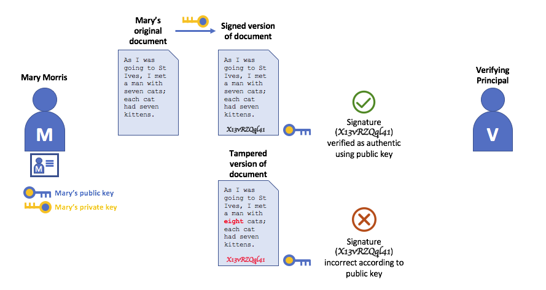

# Identity（标识）

## 什么是一个标识？

一个区块链网络中的不同参与者包括peers、orderers、客户端应用程序（client applications）、管理员（administrators）等等。这些参与者中的每一个（能够消费服务的网络内的或网络外的活动元素）都有一个封装在一个X.509数字证书中的数字标识。这些标识非常重要，因为它们**决定了参与者在一个区块链网络中对资源的确切权限和对信息的访问权限。**

此外，一个数字标识还具有一些额外的属性，Fabric使用这些属性来确定权限，并为一个标识和相关属性的联合提供了一个特殊的名称—**主体（principal）**。主体与userIDs或groupIDs类似，但是更加灵活，因为它们可以包含一个参与者标识的广泛属性，比如参与者的组织、组织单元、角色，甚至参与者的特定标识。当我们谈论主体时，它们是决定其权限的属性。

要使一个标识**可以被验证**，它必须来自一个**可信的**权威。一个成员资格服务提供者(MSP)就是用来在Fabric中实现标识的验证的。更具体地说，一个MSP是一个组件，它定义了规则，规则用于管理这个组织的有效标识。Fabric中的默认MSP实现使用X.509证书作为标识，采用一个传统公钥基础设施(PKI)层次模型(稍后将详细介绍PKI)。

## 一个简单的场景来解释一个标识的使用

假设你去一个超市买一些杂货。在收银台，你看到一个牌子，上面写着只接受Visa、万事达卡和美国运通卡。如果你想用另一张卡支付——我们称之为“ImagineCard”——不管这张卡是否真实，你的账户里是否有足够的资金。这张卡都不会被接受。

拥有一张有效的信用卡是不够的，它还必须被商店接受!PKIs和MSPs以同样的方式一起工作——一个PKI提供一个标识列表，一个MSP表示列表中的哪些标识是一个给定组织的成员，该组织参与了网络。

PKI证书颁发机构和MSPs提供了一个类似的功能组合。一个PKI就像一个卡片提供者——它提供/分配许多不同类型的可验证标识。另一方面，一个MSP类似于商店接受的卡片提供者列表，确定哪些标识是商店支付网络的可信成员(参与者)。MSPs将可验证的标识转换为一个区块链网络的成员。

让我们更详细地研究一下这些概念。

## 什么是PKIs？

一个公钥基础设施(PKI)是一组internet技术，它在一个网络中提供安全的通信。正是PKI将S放入HTTPS——如果你在web浏览器上阅读本文，你可能正在使用一个PKI来确保它来自一个经过验证的源。

公钥基础设施(PKI)的元素。一个PKI由证书颁发机构（一个或多个）组成，这些证书颁发机构向各方(例如一个服务的用户、服务提供者)颁发数字证书，然后各方在与他们的环境交换的消息中使用这些证书对自己进行身份验证。一个CA的证书撤销列表(CRL)构成不再有效的证书的一个引用。撤销一个证书的原因有很多。例如，一个证书可能会被撤销，因为与该证书关联的加密私有材料（如私钥）已被公开。

一个区块链网络不仅仅是一个通信网络，它还依赖PKI标准来确保各个网络参与者之间的安全通信，并确保在区块链上发布的消息都被正确的身份验证。因此，了解PKI的基础知识以及为什么MSPs如此重要是很重要的。

PKI有四个元素:

* Digital Certificates（数字证书）
* Public and Private Keys（公钥和私钥）
* Certificate Authorities（证书颁发机构）
* Certificate Revocation Lists（证书撤销列表）

让我们快速描述一下这些PKI基础知识，如果您想了解更多细节，可以从Wikipedia开始。

## Digital Certificates（数字证书）

一个数字证书是一个文档，这个文档包含一组与该证书持有者相关的属性。最常见的证书类型是符合X.509标准的证书，该标准允许在其结构中编码一个party的标识细节。

例如，在Detroit, Michigan的Mitchell Cars公司Manufacturing部门的Mary Morris可能拥有一个**SUBJECT**属性为**C=US, ST=Michigan, L=Detroit, O=Mitchell Cars, OU=Manufacturing, CN=Mary Morris /UID=123456**的数字证书。Mary的证书类似于她的政府身份证，它提供了有关Mary的信息，她可以用这些信息来证明有关她的关键事实。在X.509证书中还有许多其他属性，但是现在让我们只关注这些属性。

描述一个叫Mary Morris的party的一个数字证书。Mary是这个证书的**SUBJECT**，突出显示的**SUBJECT**文本显示了关于Mary的关键事实。如你所见，这个证书还包含更多的信息。最重要的是，Mary的公钥在她的证书中，而她的私钥没有。此签名私钥必须保持私有。

重要的是，Mary的所有属性都可以使用一种称为密码学的数学技术(字面意思是“secret writing”)记录下来，这样篡改证书就会使证书失效。密码学允许Mary向其他人提供她的证书，以证明她的身份/标识，只要另一方信任证书颁发者，即证书颁发机构(certificate Authority, CA)。只要CA安全地保存某些密码信息(即它自己的**私有签名密钥**)，任何阅读证书的人都可以确保关于Mary的信息没有被篡改——它始终具有Mary Morris的那些特定属性。将Mary的X.509证书看作是一个无法更改的数字标识。

Authentication（身份验证）、公钥和私钥

身份验证和消息完整性是安全通信中的重要概念。身份验证要求交换消息的各方确信创建一个特定消息的标识/身份。对于具有“完整性”的消息，意味着在其传输期间不能被修改。例如，你可能希望确保正在与真实的Mary Morris进行通信，而不是与一个模仿者进行通信。或者，如果Mary给你发了一条信息，你可能想要确保它在传输过程中没有被任何人篡改。

传统的身份验证机制依赖于数字签名，顾名思义，数字签名允许一方对它的消息进行数字签名。数字签名还为签名消息的完整性提供了保证。

从技术上讲，数字签名机制要求每一方都持有两个加密连接的密钥:一个公钥(广泛可用并充当身份验证锚)和一个私钥(用于在消息上生成数字签名)。数字签名消息的接收方可以通过检查附加的签名在预期发送方的公钥下是否有效来验证一条接收到的消息的来源和完整性。

一个私钥和相应的公钥之间的独特关系是使安全通信成为可能的密码学魔法。密钥之间独特的数学关系使得私钥可以用于对一条消息生成一个签名，只有对应的公钥可以匹配该签名，而且只能匹配这条消息。

在上面的示例中，Mary使用她的私钥对消息签名。任何使用Mary的公钥查看签名消息的人都可以验证签名。

## Certificate Authorities（证书颁发机构）

正如你所看到的，一个参与者或一个节点能够通过系统信任的一个权威机构为其颁发的数字标识参与区块链网络。在最常见的情况下，数字标识(或简单的标识)具有加密验证的数字证书的形式，这些证书符合X.509标准，并由证书颁发机构(CA)颁发。

CAs是internet安全协议的一个common部分，你可能听说过一些比较流行的CA:Symantec (originally Verisign), GeoTrust, DigiCert, GoDaddy和Comodo等等。

A Certificate Authority dispenses certificates to different actors. These certificates are digitally signed by the CA and bind together the actor with the actor’s public key (and optionally with a comprehensive list of properties). As a result, if one trusts the CA (and knows its public key), it can trust that the specific actor is bound to the public key included in the certificate, and owns the included attributes, by validating the CA’s signature on the actor’s certificate.
一个证书颁发机构将证书分发给不同的参与者。这些证书由CA进行数字签名，并将参与者与参与者的公钥绑定在一起(还可以选择使用完整的属性列表)。因此，如果信任CA(并且知道它的公钥)，则可以通过在参与者的证书上验证CA的签名来信任特定的参与者绑定到证书中包含的公钥，并拥有包含的属性。

Certificates can be widely disseminated, as they do not include either the actors’ nor the CA’s private keys. As such they can be used as anchor of trusts for authenticating messages coming from different actors.

CAs also have a certificate, which they make widely available. This allows the consumers of identities issued by a given CA to verify them by checking that the certificate could only have been generated by the holder of the corresponding private key (the CA).

In a blockchain setting, every actor who wishes to interact with the network needs an identity. In this setting, you might say that one or more CAs can be used to define the members of an organization’s from a digital perspective. It’s the CA that provides the basis for an organization’s actors to have a verifiable digital identity.
