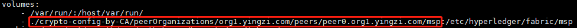

# 在Fabric集群的部署中使用由Fabric CA生成的私钥和证书

在以前部署Fabric集群时，使用的是cryptogen命令来生成每个组织的私钥和证书，但在生产环境中不建议使用cryptogen，而推荐使用Fabric CA来产生各组织的私钥和证书。

在另一篇名叫”使用Fabric CA来生成私钥和证书“的文章中，介绍了如何用Fabric CA来生成私钥和证书。

这篇文章要说的是把生成的各组织的私钥和证书用在Fabric集群的部署中。Fabric集群部署的详细流程，不是这篇文章的重点。

另外，本篇文章假设没有enable tls。enable tls还需单独研究，是另一个课题。

以下所讲的都是经过实践、实测的经验和思考。

## 1.zookeeper和kafka节点

zookeeper和kafka节点的部署不需要任何私钥和证书，但orderer的运行需要依赖于zookeeper和kafka节点，所以，建议zookeeper和kafka节点在生产环境中部署在orderer组织拥有的主机上，以确保orderer正常运行，不被其他组织干扰和破坏。

## 2.用configtxgen生成配置组件

configtxgen命令被用于创建genesis.block，channel.tx，Org1MSPanchors.tx，Org2MSPanchors.tx。且configtxgen命令会读取$FABRIC_CFG_PATH中的configtx.yaml文件中的配置。configtx.yaml文件中，对于每个组织，都有一个MSPDir配置项，指向该组织的msp文件夹，例如

    MSPDir: crypto-config-by-CA/ordererOrganizations/yingzi.com/msp
	
	MSPDir: crypto-config-by-CA/peerOrganizations/org1.yingzi.com/msp
	
	MSPDir: crypto-config-by-CA/peerOrganizations/org2.yingzi.com/msp
	
注意，MSPDir指向的是一个组织的msp文件夹，而不是组织下具体的peer的msp文件夹。那么，一个组织的msp文件夹里面包含什么文件呢？

* 该组织的CA的自签名证书
* 该组织的admin的证书

如下图所示

configtxgen命令只需要在任一组织的任一节点上执行。那么，这就意味着，执行configtxgen命令的节点只需要所有组织的CA证书和admin证书，并不需要具体peer或orderer的私钥和证书。打个比方，假设有三个组织：org1,org2,orderer。如果要在peer0.org1节点上执行configtxgen命令，那么peer0.org1节点只需要org1,org2,orderer组织的CA证书和admin证书即可。

这就是符合区块链的思想的，每个具体的peer或orderer的私钥只能由peer或orderer自己保管，不能泄露给其他人。

**注意：在部署Fabric集群的时候使用Fabric CA生成的私钥和证书，最好还是把私钥和证书按照cryptogen生成的目录结构那样组织，这样不易出错，个人认为这是最佳实践。**

## 3.启动orderer节点

启动一个orderer节点，只需要

* genesis.block。这个文件在“2.用configtxgen生成配置组件”中生成。

* 该orderer节点的msp。一个orderer节点的msp包含

    * signcerts: 这个orderer的证书
	* keystore: 这个orderer的私钥
	* cacerts: 给这个orderer颁发证书的CA的证书
	* admincerts: orderer所属组织的admin的证书，此证书同样由给这个orderer颁发证书的CA所颁发
	
	如下图所示
	
	
	
该orderer的docker compose yaml文件中的msp配置如下

总之，每个orderer节点都只需要自己的msp即可，不需要多余的加密材料。

## 4.启动peer节点

同orderer节点一样，启动peer也只需要该peer自己的msp即可，不需要多余的加密材料。如下图所示

同orderer一样，peer的msp也包含文件夹signcerts，keystore，cacerts，admincerts。但是除此之外，peer的msp还多了一个文件：config.yaml。这个文件是用于标识分类的，默认的MSP实现允许根据x509证书的OU将标识进一步划分为客户端和peer。这个文件的内容基本是固定的，如下图所示

注意：Certificate属性指向CA证书的相对路径，CA证书的证书名一定要写对。

该peer的docker compose yaml文件中的msp配置如下

## 5.启动各peer的cli节点

cli对peer进行管理和控制，每个cli节点都需要的材料是

* 各组织自己的admin的msp，粒度是到组织，不是到peer。要让peer join一个channel，必须要admin权限，也就是需要admin msp。如下图所示

	

另外，不同的cli节点支持不同的管理功能，需要的channel-artifacts也不同。

* 用于创建channel的cli：需要channel-artifacts/channel.tx。注意：channel的创建只需要任意挑选一个cli来创建就行了。

* 用于更新锚peer的节点：每个组织负责更新自己的锚peer。比如，peer0.org1 cli为org1更新锚peer，peer0.org2 cli为org2更新锚peer。那么，负责更新锚peer的cli只需要自己所属组织的锚节点交易，如peer0.org1 cli只需要Org1MSPanchors.tx，peer0.org2 cli只需要Org2MSPanchors.tx

